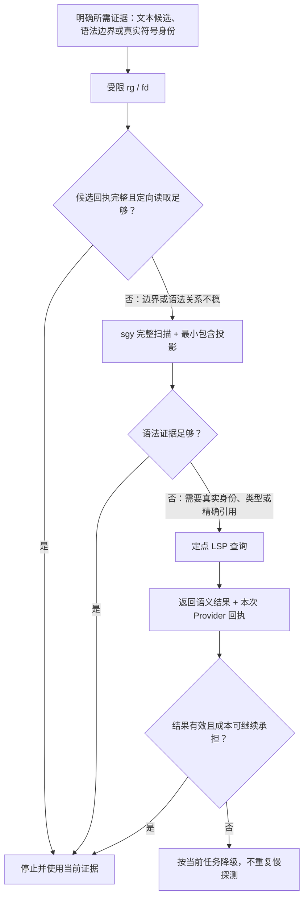

# 代码搜索流程既有改进与成本记录

> 状态：本文件保留既有方案、实现和真实 Codex 成本证据，不再承担下一阶段实施计划。统一源码查询网关的当前设计与计划分别见 [source-query-gateway/design.md](source-query-gateway/design.md) 和 [source-query-gateway/plan.md](source-query-gateway/plan.md)；尚未发布到 Codex，安装状态保持不变。
>
> 取舍顺序：先保证定位完整性和结论质量，在此基础上降低模型可见 Token，再在前两项不变差时提升速度。

## 1. 结论

当前“受限文本搜索 → AST 定界 → LSP 语义裁决”的分层方向正确，不需要推翻。主要缺口是各层尚未把模型停止或升级所需的机械事实完整交付：

1. `rg` 的可见结果有上限，但没有说明候选集是否完整；模型可能把“只看见一个”误作“总共一个”。
2. `sgy` 能给出完整 AST 位置集合，却缺少“在指定源码位置上选最小包含节点”的通用投影；模型为取得一个函数边界，可能接收大量重复路径和无关范围。
3. 路由规则描述了静态成本层级，但工具没有充分提供本次调用的完整性、实际耗时和可复用性，模型难以判断何时停止、复用或降级。
4. LSP 已在扩展内部测量 Provider 耗时和尝试次数，但协议层丢弃这些信息；`document_symbols` 也只返回选择点，不返回可选完整范围。

因此，改进重点应是建立轻量“查询回执”，让工具交付机械事实、模型继续裁决语义：

- 文本层回答“可见候选是否完整”；
- AST 层回答“哪个完整语法节点最小地包含目标位置”；
- LSP 层回答“本次 Provider 实际花了多少成本、返回了什么语义范围”；
- 路由层只根据任务形状、回执和复用机会选择下一步，不建立持久性能状态或固定全局禁令。

## 2. 目标与非目标

### 2.1 目标

- 简单搜索仍可在 `rg + 定向读取` 后结束，不因流程升级而增加固定 Token 成本。
- 任何“唯一候选”判断都有完整性证据，不从截断视图推断全集。
- 中长函数或同文件多目标查询只返回必要定位和精确正文，减少固定上下文窗口的过读。
- LSP 的升降级依据当前环境实测，而不是把某个 Provider 的一次慢结果写成跨项目禁令。
- 工具只压缩、投影和报告机械事实；真实符号身份、需求相关性和是否足以完成仍由模型结合源码与证据裁决。

### 2.2 非目标

- 不用 `sgy` 新建语言专用的“真实定义解析器”；AST 结果不冒充 LSP 符号身份。
- 不禁用 `workspace_symbols`；小项目、已就绪索引或不同语言 Provider 仍可在实测成本合适时使用。
- 不建立跨任务持久性能数据库、第二状态源或自动执行许可。
- 不要求每次查询都经过全部工具，也不把 Token 最少凌驾于完整性和正确性之上。
- 不在方案评审前修改工具、skill、MCP 协议或发布到 Codex。

## 3. 当前基线与证据边界

当前职责分层见 [`symbol-structure-workflow`](../skills/symbol-structure-workflow/SKILL.md)、[`rg-token-safe`](../skills/rg-token-safe/SKILL.md)、[`ast-grep-token-safe`](../skills/ast-grep-token-safe/SKILL.md) 和 [`vscode-lsp-mcp`](../mcp/vscode-lsp-mcp/README.md)。现有规则已经做到：已知名称或文件先用受限 `rg`，边界不稳时升级 AST，只有真实身份、类型、精确引用或安全重命名才升级 LSP。

本轮研究得到以下定向样本。Token 使用 `o200k` 统计模型可见结果，不包含 skill 首次加载、命令参数和失败回退成本；耗时只代表当时机器、工作区和 Provider 状态，不能直接外推成全局阈值。

| 场景 | 结果 | 能证明什么 |
| --- | --- | --- |
| C++ `FBAUtils::GetNodeAndParameters`，`rg + 40` 行 | 322 Token | 较短，但正文不完整，不能作为正确比较基线 |
| 同一函数，`rg + 80` 行 | 649 Token | 正文完整，但读取了函数外内容 |
| 同一函数，`rg 定位 + 精确 AST 正文` | 422 Token | 完整正文比 80 行窗口少约 35% 可见 Token |
| Python `audit_command_toolchain`，`rg + 40` 行 | 347 Token | 完整但存在边界外过读 |
| 同一函数，`rg 定位 + 精确 AST 正文` | 267 Token | 少约 23% 可见 Token |
| C++ 文件全部 `function_definition` 的 `locations` | 205 个节点；前 80 项 8,460 字符 | 完整位置列表本身会重复大量路径和无关范围 |
| 对同一列表本地选择最小包含节点 | 定位回执 99 字符 | 在取得正文前，定位输出字符减少约 98.8% |
| C++ AST 定界 | `sgy + 本地筛选` 约 198.9 ms；原生 ast-grep 流式筛选约 133.1 ms | 当前额外筛选路径仍有整合空间，但不是两个方案的稳定性能承诺 |
| AgentBase LSP 定点 definition | 约 1.619 s，返回一个精确定义 | 定点语义查询在当时环境可用且结果精确 |
| AgentBase `workspace_symbols` | 约 1.738–3.349 s，样本查询为空 | 名称搜索成本与收益依赖 Provider 和索引状态 |
| AgentBase `document_symbols` | 约 3.988 s，169 项可用、返回 10 项 | 大纲可复用时有价值；单目标查询可能付出过高固定成本 |
| UE/C++ `document_symbols` | 约 1.747 s 后 `PROVIDER_UNAVAILABLE` | 失败成本必须进入路由判断，不能把空结果或不可用当作完成 |

上述数据支持改进方向，但还不是跨语言正式 benchmark。尤其是短小函数，加载 AST skill 和启动进程的固定成本可能高于少读几行正文，因此不能把“精确 AST 正文”设成所有已知函数的固定首选。

## 4. 目标流程



同文件有多个目标时，流程不应对每个名称重复启动 AST 或请求完整大纲；应先建立一次可复用的范围集合或缓存，再对每个定位做局部投影。

## 5. 改进项总览

难度按影响面定义：低为单一 skill/辅助脚本与局部测试；中为工具实现、输出合同和多层测试；中高为跨扩展、协议、MCP server 与兼容测试。

| 优先级 | 改进项 | 权威 owner | Token 节省机制 | 难度 | 主要副作用 |
| --- | --- | --- | --- | --- | --- |
| P0 | `rg` 完整性回执 | `rg-token-safe` | 安全早停，避免截断误判后的重复搜索和返工 | 低—中 | 每次结果增加少量元数据；需正确处理提前停止和退出码 |
| P1 | `sgy` 最小包含节点投影 | `tools/sgy` / `ast-grep-token-safe` | 不向模型展开同文件全部 AST 位置，只返回目标完整范围或正文 | 中 | 坐标、嵌套节点、截断和 schema 语义必须精确定义 |
| P1b | 同文件复用与可选路径分组 | `tools/sgy` | 一次扫描服务多个目标，消除重复路径与重复进程输出 | 中 | 缓存生命周期和输出格式更复杂；单目标可能无收益 |
| P2 | 按任务形状和复用机会路由 | `symbol-structure-workflow` | 避免简单任务加载 AST/LSP，也避免多目标反复走简单路径 | 低 | 规则若写得过细会增加指令 Token，并可能固化环境偶然值 |
| P3 | LSP Provider 成本回执 | `vscode-lsp-mcp` | 复用本轮实测，避免重复慢探测和无收益升级 | 中 | 响应增加少量字段；时延具有波动，不能当稳定能力承诺 |
| P4 | `document_symbols` 精确过滤与可选完整范围 | `vscode-lsp-mcp` | 过滤无关大纲项；Provider 已付费时可直接取得完整正文边界 | 中高 | Provider 范围可能宽或不准；协议兼容和坐标合同需更新 |
| P5 | 跨工具收益验证 | `development/` | 防止局部压缩把成本转移到 skill、重试或失败链 | 中 | benchmark 维护成本；LSP 环境难完全稳定 |

## 6. 详细方案

### 6.1 P0：为 `rg` 增加完整性回执

#### 原因

当前 `rg-token-safe` 用 `Select-Object -First 80` 控制总行数，但输出没有 `complete` 或 `truncated`。与此同时，路由规则允许在“唯一候选 + 定向读取足够”时停止。两者组合后，模型只能知道“可见一个”，不知道“全集一个”。这是质量缺口，也是后续重复排查和错误修改的 Token 放大器。

#### 设计

在 `rg-token-safe` 内提供一个 Windows 辅助脚本或小型入口，执行有界 `N+1` 读取：最多向模型展示 `N` 条，只额外观察第 `N+1` 条是否存在，不扫描第二遍来计算总数。输出带紧凑回执，例如：

```yaml
_rg: {shown: 20, complete: false}
results:
  - "src/a.cpp:42:TargetName"
```

- `complete: true` 才允许把可见候选视为全集。
- `complete: false` 只表示仍有结果，不伪造总数；下一步通过更窄目录、glob、文件列表或分页继续。
- `N+1` 按匹配记录或文件记录计数，不按 `--heading` 产生的标题和空行计数；内部可解析 `rg --json`，但不把冗长 JSON 暴露给模型。
- 辅助入口负责区分“为满足上限而计划停止”与真实 `rg` 错误，并保留无匹配、I/O 错误和 pattern 错误语义。
- 单个已知文件的定点查询仍可保持纯文本输出；只有候选完整性会影响判断时才需要结构化回执。

#### 为什么能节省 Token

它本身会增加几个元数据 Token，直接收益不大；主要收益是让模型能够安全早停，或者在第一次结果截断时立即缩小范围，而不是基于错误唯一性继续读取、修改、测试后再返工。采用 `N+1` 而不是完整计数，也避免为了得到一个 `total` 进行第二次全扫描或向上下文展开更多结果。

#### 实现难度

低—中。主要工作是 Windows 进程/管道控制、退出码、UTF-8、路径格式、固定/正则参数透传和测试；不需要修改 `rg` 本身。

#### 副作用与缓解

- 回执增加少量可见 Token：只在集合查询使用，并采用单行紧凑元数据。
- 新脚本成为长期资产：由 `rg-token-safe` 唯一维护，不在全局 `AGENTS.md` 或其他 skill 复制命令协议。
- 提前关闭管道可能让 `rg` 报 broken pipe：辅助入口必须把自己触发的停止与真实失败分开，不能简单吞掉非零退出码。
- 不能证明语义唯一：回执只证明指定文本查询和范围内的结果完整。

#### 验收

- 0、1、N、N+1 和大量结果均返回正确 `shown/complete`。
- 截断结果不能触发路由中的“唯一候选”停止条件。
- 无匹配、坏 pattern、不可读路径和主动上限停止的退出语义可区分。
- 小结果的额外输出保持紧凑，不迫使所有文本查询走结构化模式。

### 6.2 P1：为 `sgy` 增加通用最小包含节点投影

#### 原因

已知函数名时，`rg` 往往能低成本给出源码行，但固定 `-C` 窗口无法可靠知道函数结束位置。当前 `sgy locations` 可以返回全部语法节点，却会为同文件的每个结果重复路径；模型若只需要一个完整函数，接收整个位置列表是无效上下文。C++ 精确 qualified-name pattern 还可能受语法歧义影响，把“让模型手写更复杂 pattern”作为常规路径并不稳定。

#### 设计

在 `sgy` 的结果投影层增加与语言无关的机械筛选，而不是增加“查定义”业务：

- 输入目标文件、0-based 行列和 `smallest` 选择；路径、行、列使用独立参数，避免 Windows 盘符与复合字符串歧义。
- 在当前完整 ast-grep 结果中保留覆盖该位置的节点，并选择范围最小者；并列时按稳定范围和原始顺序返回，不静默假装唯一。
- 默认只返回文件和 0-based、end-exclusive 范围；明确请求正文时才返回文本，并继续受单文本和总上下文字节上限约束。
- 结果为零、多个同等最小节点、目标文件不在查询范围或输入坐标非法时显式报告。
- 回执分别表达“投影是否基于完整内部结果”和“可见正文是否完整”，不复用一个 `complete` 字段混合两种含义。
- AST 查询仍由模型选择语言、节点种类、pattern/rule 和扫描范围；投影只做几何包含与排序，不声明真实符号身份。

接口形态可在实现时二选一：一条 `exec` 内完成扫描与投影，或先写入现有完整 cache，再由 `process` 对 cache 投影。单目标优先一条命令；同文件多目标优先一次 cache、多次投影。

#### 为什么能节省 Token

- 单目标只向模型返回一个范围或一段完整正文，不展开几十到几百个同文件位置。
- 中长函数以真实边界替代固定 80/120 行窗口，消除函数前后过读；当前两个样本的完整正文可见 Token 分别下降约 35% 和 23%。
- C++ 样本中，完整位置视图前 80 项为 8,460 字符，而最小包含定位为 99 字符；主要收益来自投影，不来自把 YAML 换成另一种序列化。
- 模型不必为常见“已知位置求完整节点”反复编写和调试语言特定 pattern。

#### 实现难度

中。需要修改 Rust CLI 参数、内部结果模型、cache/process 路径、Token-Safe schema、帮助文档和真实 ast-grep 回归；还要覆盖 Windows 路径和多语言范围坐标。

#### 副作用与缓解

- 嵌套函数、lambda、局部类可能有多个包含节点：由调用方先限制节点种类；工具只按明确最小范围选择并报告并列。
- AST range 不等于语义定义：skill 必须继续要求重载、类型和真实身份问题升级 LSP。
- 请求正文可能仍很大：保留字节上限和 `complete`，正文被截断时不得声称取得完整定义。
- 新投影 schema 影响缓存兼容：增加 schema 版本测试；旧 profile 默认输出不改变。
- 对很短的单函数，进程和 skill 固定成本可能大于节省：路由保留 `rg + 定向读取` 直接停止路径。

#### 验收

- 覆盖 C++、Python、TypeScript 的顶层、成员、嵌套和多行定义。
- 返回范围严格包含定位，且在适用节点集合中没有更小的包含范围。
- `complete: false` 或正文截断时不会被解释为完整函数。
- 同名重载只按位置定界，不输出语义唯一性结论。
- 当前短、中、长函数样本中，简单路径不被迫升级；中长完整正文的模型可见 Token 中位数低于完整固定窗口。

### 6.3 P1b：同文件多目标复用与可选路径分组

#### 原因

逐个函数启动 ast-grep 会重复解析文件、重复输出路径，也会让模型重复读取相同工具说明。只增加单目标投影仍未解决批量理解同一文件时的固定成本。

#### 设计

- 同一文件或同一窄目录有多个目标时，一次扫描建立完整 range cache，后续只按位置查询。
- 为确实需要多个 location 的场景增加可选 `grouped-locations` 投影：文件路径只出现一次，下面列范围；默认 `locations` 保持兼容。
- cache 回执继续给出来源命令、完整性和生命周期；不得把旧 cache 用于已变化文件。

#### 为什么能节省 Token

它同时减少工具调用参数、重复路径、重复 AST 启动结果和重复正文。收益随同文件目标数量增加；单目标不强制建 cache，避免反向增加成本。

#### 实现难度

中。现有 cache 能力可复用，主要增加按位置查询、来源版本检查和可选序列化 profile；若文件版本目前没有进入 cache 身份，还需要补机械失效条件。

#### 副作用与缓解

- cache 可能含源码和路径：沿用敏感代码边界和清理策略。
- 文件变化后范围会陈旧：查询前核对文件指纹或明确返回 stale，不能静默继续。
- 分组格式更适合机器但未必更适合人工：保持可选，不替换现有默认 schema。

### 6.4 P2：把路由从静态顺序补成动态摊销判断

#### 原因

当前成本层级正确，但“一个目标还是多个目标”“结果是否完整”“后续是否复用大纲”“Provider 本轮是否已证明慢或不可用”会显著改变最省 Token 的路径。只写 `rg < AST < LSP` 仍可能让模型在简单任务过度升级，或在多目标任务反复执行低层步骤。

#### 设计

在工具能力验证后，用一段精炼原则更新 `symbol-structure-workflow`，不引入固定毫秒阈值：

1. 单个已知目标：先 `rg + 定向读取`；边界确实不稳才做最小 AST 投影。
2. 同文件多个目标：优先一次 AST range cache；只有当前 Provider 已经可用且大纲会被复用时考虑一次 `document_symbols`。
3. 从用法位置解析真实定义：直接做定点 LSP，不先请求工作区全量符号。
4. 名称已知但文件未知：通常 `rg` 先缩小；小项目、索引已就绪或本轮 Provider 回执证明成本合适时，`workspace_symbols` 仍可使用。
5. 当前环境出现超时、不可用或成本明显失衡后，本任务内降级，不重复同类探测；出现恢复证据时才重新尝试。

路由成本同时考虑首次 skill/Provider 激活、命令与可见结果、失败升级、以及结果能否被后续判断复用，不能只比较某一次 stdout Token。

#### 为什么能节省 Token

规则让短任务避免加载 AST/LSP 的固定上下文，让批量任务把一次较高成本摊到多个目标，并把失败调用产生的重复上下文控制在一次。它是对工具回执的消费策略，只有 P0/P1/P3 提供事实后才可靠。

#### 实现难度

低。主要是压缩并替换现有路由段落、补触发/行为场景；真正效果依赖其他工具项先落地。

#### 副作用与缓解

- 规则越详细越耗常驻 Token：只保留上述稳定原则，命令细节留在对应 skill 引用。
- 固定阈值会随机器和 Provider 失效：不写全局毫秒或文件规模阈值，以当前任务回执裁决。
- 模型判断仍可能波动：用跨工具样本验证典型触发和相近非触发，不把路由脚本化为完成裁判。

### 6.5 P3：透传 LSP Provider 成本回执

#### 原因

[`provider-runtime.ts`](../mcp/vscode-lsp-mcp/packages/extension/src/provider-runtime.ts) 已为每次 Provider 调用记录 `elapsedMs` 和 `attempts`，但 [`symbol-bridge.ts`](../mcp/vscode-lsp-mcp/packages/protocol/src/symbol-bridge.ts) 的完成响应只允许 `status/candidates/warnings`，这些事实没有到达模型。于是“当前 Provider 是否便宜、是否发生轮询、是否值得复用”只能靠外部计时或猜测。

#### 设计

在 Provider 支持的只读工具集合回执中增加可选、紧凑、非权威元数据，例如：

```yaml
provider: {status: completed, elapsedMs: 1619, attempts: 1}
```

- 元数据属于当前调用观察，不进入持久配置或跨任务性能数据库。
- 成功集合与预期 Provider 失败都携带同一紧凑观察；失败仍使用现有结构化错误码，不把超时、不可用或空结果合并成同一状态。
- 路由只在当前任务复用观察，例如慢 `workspace_symbols` 失败后不立即重试；不能由一次耗时推断某语言或工具永久不可用。

#### 为什么能节省 Token

单次响应会增加通常几十 Token 以内的元数据，但可以消除额外 stopwatch 调用、重复健康探测和同类慢查询重试。它还允许在小项目或 warm Provider 上保留高收益 LSP 路径，而不是为避开最坏情况统一退回多轮文本消歧。

#### 实现难度

中。需要贯穿 VS Code companion、bridge DTO/parser、协议 schema、server 输出、生成文档和测试；内部计时本身已经存在。

#### 副作用与缓解

- 耗时受机器负载、索引 warmup 和扩展状态影响：字段命名和文档明确为 observation，不是 SLA。
- DTO 扩展可能影响严格字段校验：使用可选字段、版本化测试，并验证旧客户端默认行为。
- 元数据会增加所有 Provider 响应：只透传最小三个字段，不附加日志、绝对路径或内部命令细节。

#### 验收

- 完成、空结果、轮询后完成、超时、不可用和取消均保留原状态语义。
- `elapsedMs/attempts` 从扩展到 MCP 输出不丢失、不重复，且不会出现在非 Provider 工具上。
- skill 行为用例证明：一次慢/不可用观察后降级；小项目或已就绪 Provider 仍允许使用 `workspace_symbols`。

### 6.6 P4：为 `document_symbols` 增加精确过滤和可选完整范围

#### 原因

当前 `DocumentSymbolsInput` 只有文件、kind、深度、上下文和结果窗口；Provider 即使返回完整 `range/selectionRange`，公开 DTO 也只保留 `path + line + column`。模型若只需一个已知符号，可能接收大纲窗口后仍要用 AST 找正文边界。

#### 设计

- 增加可选精确过滤，如 `nameEquals` 或 `pathEquals`；过滤必须发生在结果窗口之前。
- 重载或同名嵌套项返回全部精确匹配，不把名称相等当作语义唯一。
- 增加 `includeRange: true`，按公开协议约定返回完整范围；坐标基数和 end-exclusive 语义写入 schema。
- 默认输入和默认输出保持当前紧凑点位置，避免所有调用都承担 range Token。

#### 为什么能节省 Token

精确过滤减少无关大纲项；当 Provider 已 warm、查询成本可接受且范围可靠时，可直接用一个结果定向读取完整正文，省掉额外 AST skill、进程和位置列表。该项主要降低模型可见结果和后续调用数，不会降低 VS Code Provider 枚举整份文档的内部时间。

#### 实现难度

中高。需要修改输入/输出 DTO、tool schema、bridge、extension 映射、排序/窗口顺序、文档和多层测试；还要处理 VS Code `DocumentSymbol` 与 `SymbolInformation` 两种返回形态。

#### 副作用与缓解

- 部分 Provider 的 range 过宽或不准确：范围是 Provider 观察，源码读回仍是验收；必要时可降级 AST。
- 过滤语义可能产生大小写和语言差异：只提供明确的 ordinal exact match，不先做模糊匹配。
- range 增加响应 Token：默认关闭，只有能替代下一次边界查询时开启。
- Provider 仍可能很慢或不可用：必须与 P3 回执和现有降级合同配合，不能把它提升为普通已知函数的固定首选。

#### 验收

- 精确过滤在分页前执行，重复名称全部保留，大小写和路径比较符合公开合同。
- 默认响应与当前 schema 兼容；只有 `includeRange` 才增加范围字段。
- 范围坐标能定向读回完整源码，Provider 范围异常时有明确降级路径。
- benchmark 单独报告可见 Token、Provider 耗时和被省掉的后续调用，不能只计算过滤后的响应。

## 7. 验证与收益判定

### 7.1 质量门槛

- 截断 `rg` 结果不能被判断为唯一全集。
- AST 投影必须返回完整最小包含节点，或明确返回无结果、并列、stale、截断；不得输出伪完整正文。
- AST 和名称过滤不证明真实符号身份；需要重载、类型、精确引用或 rename 时仍走 LSP/编译证据。
- LSP 回执不改变工具成功、失败、空结果和 Provider 不可用的现有语义。
- 简单已知目标仍可不加载 AST/LSP，不能为了 benchmark 得分强制走新入口。

### 7.2 Token 指标

跨工具 benchmark 至少分别记录：

1. 模型可见结果的 `o200k` Token；
2. 为该路径加载的 skill 正文和命令模板成本；
3. 成功前全部调用、失败和回退结果；
4. 同一中间结果服务多少后续目标。

只有把这四项相加后，才能判断端到端路径是否更省。不能只证明 YAML 比 JSON 短，也不能用不完整的 40 行窗口击败完整 AST 正文。

### 7.3 样本

沿用本轮多语言真实工程样本结构并扩展为可复现集合：

- 已知文件/名称与未知文件/名称两大类；
- C++、Python、TypeScript；
- 短、中、长函数，嵌套函数/lambda，重载和同名项；
- 同文件单目标与多目标；
- 生成物、镜像和测试替身干扰；
- `rg` 结果恰好为 0、1、N、N+1；
- LSP 快、慢、空结果、超时和不可用状态。

正式比较使用 warmup 后多次样本的中位数，同时保留首次冷启动成本；LSP 结果记录 VS Code、语言扩展、工作区和索引状态。环境无法稳定控制时，只报告观察范围，不建立阻断性速度门禁。

### 7.4 收益边缘

每个改进独立比较以下结果：

- 是否消除了一个会影响正确性的证据缺口；
- 是否在适用样本中降低端到端 Token，而没有迫使非适用样本升级；
- 是否减少总耗时或至少没有以明显速度退化换取微小 Token；
- 新增长期概念、schema、脚本和维护成本是否小于持续收益。

若新增优化只在单个样本减少少量 stdout，却增加常驻 skill 文字、跨包协议或失败分支，则停在当前层，不继续实现。

## 8. 实施顺序

1. **固定基线**：把本轮代表性样本转成可复现输入，先记录质量、Token、冷/热耗时和失败路径。
2. **实施 P0**：先解决 `rg` 截断却可被误判为唯一的质量问题；只修改 `rg-token-safe` 的 owner 与测试。
3. **实施 P1/P1b**：在 `sgy` 内完成通用最小包含投影和同文件复用，先验证真实引擎，再更新 `ast-grep-token-safe` 用法。
4. **重跑跨工具样本**：确认简单路径不回退、中长正文和多目标路径确有净 Token 收益。
5. **落实 P2**：只把已经由工具证明的稳定选择原则写入 `symbol-structure-workflow`，删除被替代的旧表述，不重复工具细节。
6. **实施 P3**：透传当前调用成本；先验证响应兼容和失败语义，再让路由消费。
7. **按实测决定 P4**：只有 `document_symbols` 在目标环境中经常可用、完整范围能稳定替代一次 AST 查询时才实施；否则保留为候选，不为接口完整性扩张协议。
8. **发布前验证**：按影响范围运行组件测试；skill 触发或策略变化后再运行静态合同和独立隔离路由评估。每次发布到 Codex 仍单独取得用户明确同意。

## 9. 原建议裁决

建议批准 P0、P1、P1b、P2 和对应跨工具 benchmark 作为第一批：它们直接修复完整性或减少语法定位输出，且不依赖 LSP 环境稳定。P3 作为第二批，价值在于让条件性 LSP 路由有实测依据。P4 暂不承诺实施，先用 P3 的真实回执和第一批 benchmark 判断它能否稳定替代 AST 调用。

这套顺序保留当前工具分层，也把新增长期职责控制在各自 owner 内：`rg-token-safe` 负责文本结果完整性，`sgy` 负责结构结果投影，`vscode-lsp-mcp` 负责语义 Provider 事实，`symbol-structure-workflow` 只负责选择。这样能在不增加平行搜索规则源的前提下，优先取得最大 Token 收益。

## 10. 实施结果

用户随后批准全部改进项，P0–P5 均已进入对应正式 owner：

- `rg-token-safe` 的 `rg_receipt.py` 以匹配/文件记录执行 N+1 读取，分开报告查询完整性和单行正文完整性，并拒绝会破坏回执的内部结果上限与输出模式。
- `sgy 0.1.2` 增加 `process containing`、`process group-locations` 和显式 `--fingerprint-file`；位置复用要求执行前、提交和查询时整文件一致，旧 cache 或未登记文件不能静默使用。
- `symbol-structure-workflow` 按单目标、多目标、真实身份、当前 Provider 观察和复用机会动态路由，不写固定毫秒阈值或 `workspace_symbols` 全局禁令。
- `vscode-lsp-mcp` 的 workspace/document symbol 查询透传当前调用的 `status/elapsedMs/attempts`；`document_symbols` 支持分页前 ordinal exact 名称/完整路径过滤及默认关闭的 1-based、end-exclusive 完整范围。
- `development/code-search-benchmark` 提供只分析、不执行搜索的统一核算入口，把 skill、命令、成功前全部结果、失败回退、冷/热耗时和复用目标数计入端到端成本。

升级后在同一真实 TypeScript 文件上进行了三次重复观察；`sgy` 使用同一完整 `method_definition` cache 和整文件 fingerprint：

| 场景 | 路径 | 结果 Token | 含首次 skill 的总 Token | warm 总 Token | 中位耗时 |
| --- | --- | ---: | ---: | ---: | ---: |
| 单个 76 行方法 | `rg` 完整性定位 + 固定后读 90 行 | 1,100 | 2,550 | 1,238 | 191.28 ms |
| 单个 76 行方法 | `rg` 定位 + `sgy containing` | 1,013 | 5,843 | 1,148 | 418.58 ms |
| 同文件三个方法 | `rg` 定位 + 三次固定后读 90 行 | 3,008 | 4,529 | 3,217 | 204.44 ms |
| 同文件三个方法 | 一次 cache + 三次 `sgy containing` | 2,312 | 7,157 | 2,462 | 548.24 ms |

该样本直接支持动态路由而非统一升级：单目标冷路径的 AST 固定成本明显不值，已加载能力或同文件多目标时精确投影分别减少约 7.3% 和 23.5% warm 可见 Token，但仍比 `rg` 慢。质量、Token、速度的取舍顺序保持不变；这些耗时只属于本次环境观察，不构成跨项目阈值。

## 11. 真实 Codex 端到端 A/B 结果

局部工具输出变短不等于代理总成本下降。为检查首次 skill 加载、命令、工具回合、失败回退、模型回答和推理的合计影响，本轮以当前已安装 Codex 为基线、以仓库候选内容发布到隔离临时 Codex 根目录作为候选，运行了真实 `codex exec --json --ephemeral` 对照。live Codex 未被发布或改写。

两组固定使用 `gpt-5.6-sol`、`medium` 推理深度、`default` service tier 和 `project_doc_max_bytes = 65536`。语料包含 AgentBase 与真实 UE 大型项目中的文件发现、规则来源、TypeScript 定义、Rust 合同、C++ 完整定义和 C++ 全部调用位置共六类只读任务；每个任务按 A-B-B-A 顺序执行两次基线和两次候选，共 24 个完整回合。总 Token 使用 Codex `turn.completed.usage` 的 `input_tokens + output_tokens`；`reasoning_output_tokens` 已包含在输出中，只单列观察，不重复相加。

### 11.1 聚合结果

| 指标 | 当前安装态 | 仓库候选 | 候选变化 |
| --- | ---: | ---: | ---: |
| 回合 | 12 | 12 | — |
| Input Token | 1,751,898 | 2,178,931 | +24.4% |
| 其中 cached input | 1,443,328 | 1,754,624 | +21.6% |
| 非 cached input | 308,570 | 424,307 | +37.5% |
| Output Token | 13,324 | 14,612 | +9.7% |
| 其中 reasoning output | 5,043 | 4,605 | -8.7% |
| 总 Token | 1,765,222 | 2,193,543 | **+24.3%** |
| 总耗时 | 835.899 s | 777.845 s | -6.9% |
| shell 与 MCP 工具调用 | 56 | 63 | +7 |

候选每回合总 Token 中位数为 164,151，安装态为 147,475；12 个配对中候选 9 次更高、3 次更低，配对差中位数为 +29,158 Token（+29.2%）。候选本次更快，但它以更多 Token 换取约 6.9% 总耗时下降；按项目“质量优先，其后 Token，再速度”的顺序，这不是可接受的总体收益。

### 11.2 分任务结果

| 任务 | 安装态均值 | 候选均值 | 候选变化 |
| --- | ---: | ---: | ---: |
| 文件发现控制 | 75,056 | 88,038 | +17.3% |
| rg 规则来源 | 102,516 | 148,914 | +45.3% |
| TypeScript ProviderObservation | 147,475 | 138,770 | -5.9% |
| Rust sgy containing 合同 | 196,972 | 159,100 | -19.2% |
| C++ `FUeAgentCommandDispatch::Submit` | 148,950 | 214,409 | +43.9% |
| C++ `IsBareKey` 全部位置 | 211,643 | 347,540 | +64.2% |

自动正则 oracle 两组都记录 9/12 通过，其中四个 sgy 失败是明确的词面假阴性：答案已经给出半开区间 `[start,end)`，oracle 却只接受英文 `end-exclusive`。剩余两条 ProviderObservation 答案给出了 DTO 定义、泛型字段及其行号，但没有额外写出 `document_symbols` 映射表达式的第 694 行；保守按全部位置证据验收时两组均为 11/12，按问题核心语义验收时均为 12/12。故本轮没有观察到答案质量差异，原始自动 oracle 也不能用来声称质量退化或提升。

### 11.3 成本机制

1. `rg_receipt.py` 当前把原生参数列表中的任何 `--no-heading` 都当成输出格式开关，没有区分它是 `-e '--no-heading'` 的 pattern 值。两个候选回合因此先失败、再改 pattern，另一次还读取整个脚本排查；这是直接可复现的参数解析缺陷，而不是必要完整性成本。
2. C++ 完整定义任务的候选冷路径加载了更多 skill，并在一个回合中经历两次空 AST 投影后才取得正确范围；另一个回合虽然成功，仍把简单的小函数定位升级为 AST。局部投影输出很短，但额外模型回合使端到端 Token 增加。
3. C++ 全部位置任务的候选在完整 rg 回执后又调用 LSP `list_workspaces/get_references`；两个样本分别产生 2 和 3 次 MCP 调用。LSP 结果与已经完整的定向文本候选一致，没有改变答案，却显著增加了累计上下文。
4. 候选也有真实收益：ProviderObservation 与 sgy 合同任务分别少约 5.9% 和 19.2%，说明回执与投影本身并非无效；退化来自触发边界、失败路径和额外回合，而不是结构化输出这一概念本身。

### 11.4 结论与后续门槛

本次观察足以否定“当前候选已经稳定降低真实总代价”，但不足以把 +24.3% 外推为跨项目固定效应：只有六类任务、每类两个配对，配对均值差的 95% 区间仍跨过零；两组 stderr 还都出现 skill 扫描达到 traversal limit，隔离候选与实时用户 Codex 根目录也不是完全对称的运行环境。当前候选不得仅凭局部工具 Token 数据发布为节省 Token 的完成版本。

下一轮应先消除已证实的非必要成本，再复用同一语料重测：

1. 修正回执参数解析，使 pattern 值不会被当作输出模式；覆盖以 `-` 开头、与禁用 flag 同名和多个 `-e` 的正反场景。
2. 收紧动态停止条件：完整回执与定向源码读回已经满足任务时停止；只在真实符号身份、重载解析或语义引用会改变结论时承担 LSP 成本，不因“全部位置”字样机械升级。
3. 冷路径的小型已知函数优先直接定向读取；只有边界确实不稳、结果会复用或 AST 已加载时才做最小包含投影，并避免失败后重复试探等价 pattern。
4. 新一轮继续报告真实 Codex 的总 Input、cached、Output、reasoning、工具回合、质量与耗时；局部 stdout Token 只解释机制，不再作为总体发布依据。

## 12. 五-skill 消融对照

完全忽略用户规则与配置的“裸 Codex”不能单独归因代码搜索 skill，因而不再作为主对照。主对照改为同一候选快照的五-skill 消融：保留相同模型、推理深度、service tier、项目、`AGENTS.md`、`config.toml`、其他 skill、插件、MCP 与底层 `rg`、`fd`、ast-grep、LSP、PowerShell 工具，只移除以下 skill 目录：

- `rg-token-safe`
- `fd-usage`
- `ast-grep-token-safe`
- `symbol-structure-workflow`
- `powershell-usage`

候选与消融环境的 `AGENTS.md`、`config.toml` 和其余 skill 树哈希逐项相等，skill 集合差异恰好是上述五项。沿用六类任务、每类两次及 A-B-B-A 顺序，共得到 12 个候选回合和 12 个消融回合；当前安装态的既有结果冻结复用，没有重跑。

### 12.1 聚合结果

| 指标 | 收紧触发后的候选 | 五-skill 消融 | 候选相对消融 |
| --- | ---: | ---: | ---: |
| 回合 | 12 | 12 | — |
| Input Token | 1,372,957 | 1,149,926 | +19.4% |
| 其中 cached input | 1,046,016 | 802,816 | +30.3% |
| 非 cached input | 326,941 | 347,110 | -5.8% |
| Output Token | 10,057 | 7,185 | +40.0% |
| 其中 reasoning output | 3,717 | 2,692 | +38.1% |
| 总 Token | 1,383,014 | **1,157,111** | **+19.5%** |
| 总耗时 | 582.805 s | 508.509 s | +14.6% |
| shell 与 MCP 工具调用 | 40 | 29 | +11 |

五-skill 消融相对候选少 225,903 Token（-16.3%）。候选相对冻结的当前安装态 1,765,222 Token 已下降 382,208（-21.7%），说明触发与停止条件修正确实消除了上一轮的大量退化；但消融结果同时证明，这五个 skill 在本组任务上的加载、解释与额外工具回合仍未被其局部节省抵消。

### 12.2 分任务结果

| 任务 | 候选均值 | 五-skill 消融均值 | 候选变化 |
| --- | ---: | ---: | ---: |
| 文件发现控制 | 75,066 | 47,179 | +59.1% |
| rg 规则来源 | 90,010 | 61,971 | +45.2% |
| TypeScript `ProviderObservation` | 134,789 | 79,888 | +68.7% |
| Rust sgy containing 合同 | 170,963 | 156,834 | +9.0% |
| C++ `FUeAgentCommandDispatch::Submit` | 117,403 | 140,598 | -16.5% |
| C++ `IsBareKey` 全部位置 | 103,275 | 92,086 | +12.2% |

六项中五项候选更贵，只有需要完整函数边界的 C++ 任务从结构化路由获益。该分布说明问题不只是正文长度：skill 首次加载、规则解释和新增调用轮次是主要固定成本，而精确范围能力在边界确实重要时仍有价值。因此后续优化应继续压缩触发后必读内容并减少无增量证据的调用，而不是删除底层工具或把 AST/LSP 一概禁用。

两组答案按任务核心语义均为 12/12 正确。原始正则 oracle 为候选 8/12、消融 10/12；差异来自已确认的词面假阴性：`ProviderObservation` 对正确泛型字段答案额外要求字面行号 `694`，sgy 对 `[start,end)` 的正确半开区间表述额外要求英文 `end-exclusive`。原始 oracle 不用于推断质量差异。

此前完全裸环境的 1,082,040 Token 只保留为辅助理论下界。它比五-skill 消融还少 75,071 Token，但同时移除了其他规则、skill 与配置，不能把这部分差额归因于代码搜索能力。

第三版压缩后曾启动新的 24 回合基准；用户要求停止后已终止运行进程。该轮不完整，未生成可比聚合结果，也不进入上述统计；五-skill 消融的完成结果固定记录为本节数据，不再重跑。
