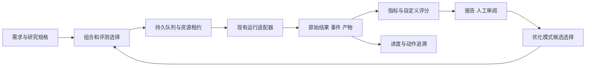

# AgentBase Evo 基本设计

本文件面向用户、方案维护者和实施模型，定义职责、数据关系与行为边界；依据 [用户需求](requirements.md)、[用户设计](user-design.md)和[现状证据](current-state.md)。条目状态 `proposed` 表示模型设计可随直接证据修订，不代表用户指定的实现方式，也不判断实施完成。实施步骤归 [solution.md](solution.md)，实际结果归 [任务表](TASK_TABLE.md)，额度与工期假设归 [estimates.md](estimates.md)。

## DES-001 产品范围与模式

- 状态: proposed
- 关联: REQ-001, REQ-002, REQ-003, REQ-005, UDES-001, UDES-002, CON-001, CON-002

Evo 是 AgentBase 下的本地组合评测与演进框架。支持两种模式：`evaluate` 对指定组合运行/评分，或仅计算已有产物；`optimize` 在同一评测能力上增加有界候选生成、比较与选优。只评分不要求候选修改、基线或搜索配置；两者均可接入程序、模型及人工评分。

七类被测组件为 AGENTS 指令、skills、hooks、MCP、工具、子 agent 设置、Codex 设置。每类可独立选择，组合必须满足实际依赖闭包。选择来源、启用成员、允许修改的内容与运行环境分别声明；未选择不表示静默继承当前宿主安装。用户指定的对象、数据与变更权限决定研究边界，框架不自行部署、发行或调整当前对话推理深度。

首版交付本地 CLI、持续进度视图与可离线阅读的报告/评审包，完整 Web 平台、分布式集群和在线技能商店不是必要条件。

## DES-002 职责与权威来源

- 状态: proposed
- 关联: REQ-004, DES-001, OBS-001, OBS-002, OBS-003, OBS-004, OBS-005, OBS-006

在 `development/agent-evaluation` 中增加 Evo 编排职责，不整体引入外部框架。借鉴候选谱系、失败反馈、盲比和经验筛选，运行仍依靠 AgentBase 现有 Windows 后端。

| 职责 | 唯一 owner 与消费者 |
| --- | --- |
| 研究规格、选择、队列、预算、比较 | Evo；CLI、优化控制器和报告读取同一状态 |
| 组合解析与候选投影 | 扩展 `agentbase_codex.py` 现有投影职责，原 SWE 默认组合与 Evo 都消费它 |
| SWE 逐题资格、执行及原始结果 | `agent_eval.py`、`evaluation_core.py`、`windows_verifier.py`；Evo 适配器引用其结果 |
| 领域行为与验证 | 路由、hook、MCP、CLI 原 owner；适配器只衔接输入、生命周期与证据 |
| 模型启动、环境过滤、用量 | `development/common` 及现有候选用量职责，扩展实际需要的来源支持 |
| 原生会话动作解析 | `codex-event-logger` 已有只读审计职责；Evo 关联事件，不维护第二套同责解析 |
| 数据指标、评分规则和派生结果 | Evo 评分职责；原 reward、领域判定、人工原始评分保持各自来源 |
| 部署与发行 | 原正式入口，Evo 只导出候选差异和报告 |

控制器、观察器、评分器采用研究冻结版本。即使候选修改了相关组件，也不能让候选替换判断自身结果的外部观察/评分代码。已有职责原位扩展；只有新职责无既有承担者时才新增模块，不通过多层包装重复维护决定。

## DES-003 对象、版本与选择

- 状态: proposed
- 关联: REQ-001, REQ-005, REQ-006, REQ-013

| 对象 | 定义与身份边界 |
| --- | --- |
| 组件组合 | 七类来源、成员与依赖；源码、构建/投影、实际运行身份分别绑定 |
| 评测项与评测组 | 项拥有输入、任务合同与观察/评分需求；组只引用项，可增删并命名激活 |
| 评分配置 | 数据选择、指标/公式、归一化、聚合、缺失处理和用途；与组件组合、评测组分别版本化 |
| 研究快照 | 冻结模式、来源、组合、激活集合、适用关系、运行配置、评分配置和预算 |
| 作业与 attempt | 作业是冻结计划中的逻辑工作；attempt 是一次实际尝试；执行阶段是游标，不生成新评测身份 |
| replicate | 启动前声明的统计重复位置；与错误重试不同，不用新别名绕过尝试复用 |

多个组引用同一项时，按案例/输入版本、组合和运行协议去重执行。评分协议若仅改变计算，不改变执行身份；同一产物可以产生多个评分版本。若评分需要不同观察或输入，则生成不同执行计划，不能把不足的旧轨迹当完整证据。删除目录项须处理引用，已冻结研究仍能恢复原选择；空选择只得到空计划。

整体成绩报告实际样本与选择范围；重叠分组可各自展示，整体不能重复计数。改变组或公式后保留旧结果，不能停用失败项后宣称原范围已改善。

## DES-004 组合组装与实际运行

- 状态: proposed
- 关联: REQ-001, REQ-010, REQ-011, OBS-002, OBS-003

解析器先输出最终成员、依赖、来源、冲突和能力缺口，再准备运行资产。配置键只有一个明确来源；AGENTS 区分作用域与注入顺序；skills 按声明资产选择；hook 使用真实事件绑定；MCP 绑定 server/companion/Provider；工具绑定候选构建产物；角色和 Codex 配置绑定实际受测运行。

同一 `[agents]` 或 feature 键由不同来源定义时不以覆盖顺序静默选择。认证、信任哈希、宿主缓存和项目私有状态不进入可移植候选；真实安装只承担既有授权连接职责，不作为源码。需要的软件缺失只报告前置条件。

每类组件都有“配置期望 → 实际加载 → 适用行为”证据：角色文件存在不证明角色可用，MCP schema 不证明调用成功，源码变更不证明新二进制已使用。CLI 适配器不能替代桌面专属行为；能力无法证明时标记未支持的范围。受测模型/参数只有在研究明确选择为变量时才改变，其余固定；不操作当前对话设置。

## DES-005 单次流程、并发与恢复

- 状态: proposed
- 关联: REQ-007, REQ-008, REQ-011, REQ-012

单次流程为冻结输入、排队、准备环境、启动与交互、收拢后代、独立验证、评分/人工、结算归档。`score` 可从已有产物直接进入计算，不启动 subject。框架记录阶段，不强制被测 agent 按固定思考步骤或逐动作播报。

本机共享调度根对所有 Evo 研究执行总资源上限；单研究只能申请其中额度。使用持久队列、原子领取和资源租约，资源租约表示一项作业对特定容量或独占对象的临时占用。独立就绪作业公平排队；受某种资源阻挡时，不挡住其他可运行作业。

分别限制根作业、模型容量、构建/内存、磁盘准备和独占 Provider。子代理仍归原作业；启动前按可证明的最大代理占用预留，避免父代理占满根槽位后等待子代理死锁。运行时无法约束内部请求时，不承诺请求级硬上限；不能通过关闭被测角色或降低模型偷偷满足限额。

阶段为 `queued/preparing/running/verifying/grading/awaiting_human`，终态区分执行完成、基础设施失败、取消和无效；任务成功与执行结束独立。`pause` 停止新派发并让在途工作到可恢复位置；`cancel` 按适配器终止本次拥有的进程及后代，保留已花成本。人工待评不占模型/执行槽位。

外部调用前登记 attempt 与预算，结束后依收据结算。恢复先对账进程启动身份、产物、租约和调用结果，心跳过期不等于进程已死；结果不明时不重复调用模型。原始结果已有则续做验证/评分，行为失败不自动重跑。

## DES-006 环境与磁盘复用

- 状态: proposed
- 关联: REQ-007, REQ-010, OBS-008

按三层管理：不变来源/依赖/构建缓存按身份共享；可写工作区槽位独占；尝试证据独立归档。排队只存描述，不预建完整工作区。同构建键只准备一次，等候者引用同一结果；同时运行必须有独立可写状态。

复用键包含来源、依赖、投影 recipe、运行配置和宿主能力；适配器声明保留缓存、重置内容和重置后检查。只恢复受管差异，不默认整树删除重建；脏状态不明的槽位隔离后按预算修复。可写配置和题目文件不硬链接到真实安装、来源或其他候选。有状态服务只有在会话清理及健康检查成立时复用，否则作业后关闭。

预算同时覆盖受管总占用、在途预留、缓存/槽位与最低空闲空间；优先回收无租约且可重建的冷资产。必要证据达到预算则暂停新增工作，不自动删掉结果。冻结 base、patch、recipe 与必要产物可代替每个候选常驻完整 checkout。冷/热缓存是评测条件，不能为复用而改变；记录复制/删除量、准备耗时和实际占用，不重复累加共享资产。

## DES-007 事实数据与代理用量

- 状态: proposed
- 关联: REQ-009, REQ-011, REQ-012, OBS-008, OBS-009

数据目录暴露已采集字段的名称、类型、单位、粒度、来源及完整性，包括质量结果、各类 Token、时间、工具次数、代理关系、环境开销和人工评分。字段可扩展，不限于固定白名单中的几个评分维度；新增字段仍须明确实际来源，不能把缺失值补成零。

每次请求尽可能关联实际模型、角色、代理/turn、发起者、用量和来源位置。创建树与消息/复用关系分开，主代理及所有后代总账只计实际请求一次；继承历史、重复累计通知、已含后代的父级汇总均不能重复相加。主代理返回后仍须收拢后代，未结束或未结算者继续保留预留与缺口。

输入总量包含相应缓存子类，输出总量包含推理输出；不能把总项与子项相加。局部文本 tokenizer 计数与真实请求 Token 是不同指标。时间区分排队、准备、subject 墙钟、验证、评分、人工等待和代理累计活动时长；并行代理时间和批次耗时不能混算。工具次数区分调用尝试、成功/失败、外层组合调用与已观察的内层调用。

使用成本覆盖 subject 与后代；研究成本还覆盖评分、提案、实现和失败候选。旧收据复用保留历史使用成本，本轮只计实际新增支出，也不新增独立统计样本。用量不足时继续报告已证质量，但不进入完整成本排名。

## DES-008 自定义评分与计算

- 状态: proposed
- 关联: REQ-003, REQ-005, REQ-006, REQ-009, REQ-013

评分链为“原始事实/已有评分 → 数据选择 → 派生指标 → 一个或多个评分输出 → 可选比较策略”。用户能按研究、组合、组/项、模型、角色/代理、阶段、状态和重复位置选择已取得数据，设置筛选、分组、聚合、计算式及方向；不强制综合成一个总分。

初版提供声明式表达式：字段引用、四则运算、条件、比较、比例、权重、固定基准归一化，以及 count/distinct/sum/mean/median/percentile/min/max 等有界聚合。依赖其他指标形成无环计算图；类型、单位、粒度和连接键在计算前检查。不同粒度先聚合再关联，不能把每请求 Token 与多条工具事件直接多对多连接后重复累加。

每个输出声明数据范围、单位、缺失/不适用/错误/零除处理、样本分母和用途。默认缺失传播为 unknown；显式排除或估算只生成标注覆盖/假设的分析结果，不改原始事实。可以自由设权重和公式，但不能静默把质量差异、计数口径或不完整样本包装成同等可比。

公式示例仅说明表达能力，均非默认目标：

| 输出 | 计算含义 |
| --- | --- |
| 合格率 | 合格样本数 / 已声明范围内可判定样本数，同时报告未评/异常数 |
| 每个成功结果的 Token | 选定范围全部实际尝试 Token / 合格结果数，失败消耗不隐去 |
| 缓存读取比例 | 可比请求的缓存读取 Token / 输入 Token |
| 工具调用成本 | 在选定代理/阶段去重后的调用尝试数，可另列失败比例 |
| 自定义效率分 | 用户质量分与归一化 Token、耗时、调用次数按自定公式组合，公开权重和参考值 |

评分配置独立命名和版本化，可同时对同一证据算多套分数。修改公式后只重算受影响指标；需要新主观判断时才按授权调用 grader，需要新运行证据时才形成执行计划。对内置表达式无法覆盖的计算，提供固定版本本地计算器入口，消费指定数据快照和结构化输出；它作为受信任本地代码单独授权执行，不用任意 `eval` 或把配置伪装成沙箱。

结果保留原始值、公式/参数版本、选择快照、有效/缺失样本数、来源和中间指标，可从分数回到事件/产物。展示排序可选择自定义分数；用于自动晋升时仍遵守外部质量、授权、证据与非劣约束，不能用一个成本优势抵消关键行为失败。

## DES-009 过程追溯与监控

- 状态: proposed
- 关联: REQ-008, REQ-011, REQ-012, DES-005, DES-007, OBS-009

优先被动采集宿主和组件正式事件：输入/公开计划、动作开始/完成、工具参数及可用返回、文件差异、消息/等待、hook/MCP、警告、压缩、用量与评分。记录宿主/解析器版本；CLI JSON、App Server、原生 session 彼此保留来源，未知事件不能静默丢弃。被测 observer 不能替换研究观察器。

一个动作有稳定关联和若干事件，事件保存可用的来源时间、接收时间、流内顺序、来源位置、状态及输入/输出引用。跨代理用已证调用/消息关系建立先后，不只按时间邻近猜因果。只见外层组合调用时不推断所有内调用执行；阶段文件差异只证明区间内变化。私有推理和工具内部未暴露动作不承诺还原。

准备时声明 supported/partial/unavailable 等能力，结束时另报 observed/missing/truncated/redacted 等实际覆盖。日志扫描完整不证明宿主记录全部行为；非必要缺口不阻断已有质量结论，必要评分证据缺失则该项未验证。来源可恢复时按位置补录去重，否则保留缺口。

`status/watch` 显示队列、阶段、已结束与合格/失败/待评数量、代理/模型用量、预算/磁盘及等待原因；`trace` 按阶段、代理、工具、路径、错误和评分项渐进展开。总体按去重计划统计，评分覆盖率不冒充通过率，未来优化轮次不显示伪精确完成率。监控是普通程序，不让模型忙轮询；关闭监控不取消作业。

轨迹正文和附件本机去重保存，必要时压缩；同一内容不在事件、报告、评审包反复嵌入。保留当时取得的必要可变内容，仅有 URL/路径不足以回看。默认不全程录屏、逐工具复制目录或全仓库扫描。采集开销与配置进入对照条件，容量不足显式降级/暂停；认证、无关宿主内容和私有推理不归档，脱敏缺口可见。回看不执行历史动作。

## DES-010 人工与自动迭代

- 状态: proposed
- 关联: REQ-002, REQ-003, REQ-005, REQ-013

人工评审绑定产物和 rubric 版本，支持盲比、逐项评分及有依据的更正；空白不算认可，更正追加替代关系而不覆盖旧记录。需人工决定时持久保存并释放资源，可在后续导入继续；范围或 oracle 变化重新版本化。

优化使用固定控制器、原始基线、当前优选和有限挑战者。模型从已允许的失败/成本证据提出可证伪修改，按 mutable 范围实现并冻结，再消费相同执行/评分链。按任务家族划分开发、选优、最终验收数据；同源变体不跨集，最终验收反馈用于改写后即不再属于未见数据。

比较先过行为/证据和各必需族质量约束，再按明确策略比较成本、速度及用户选定评分。独立评测可并行，依赖当前结果的下一轮候选不能抢跑。预算耗尽、无改善、重复假设、能力缺口或需裁决时停止并交付已有结果；不保证必然优化成功。

## DES-011 存储与模型交互面

- 状态: proposed
- 关联: REQ-005, REQ-008, REQ-010, REQ-012, REQ-013, CON-002

本地 state root 保存用户规格、目录/评分定义、冻结快照、研究数据库和证据；work root 只放可重建工作区，cache 按生命周期管理。它们与源码及真实安装分离。框架、schema、合成例可提交，真实题目、轨迹、私有评分和账户信息不提交。

| 资产 | 修改者、消费者与恢复 |
| --- | --- |
| 规格/目录/评分定义 | 用户或获授权模型按稳定条目编辑；运行读冻结快照，后改不影响历史 |
| 调度与资源状态 | 调度器事务写入，CLI/优化器读；恢复以进程和原始收据对账，不由模型编辑生成状态 |
| 原始收据/产物/事件 | 运行 owner 写入并固定来源；Evo 引用，归档前确保不依赖易丢失临时目录 |
| 指标/分数/人工裁决 | 计算器或明确导入写版本结果，引用证据；更换规则生成新结果，不覆写原 reward |
| 追溯索引/报告 | 从状态与证据按版本重建；模型从摘要到单项渐进读取，不通过编辑报告改变事实 |

模型面使用短别名和可定位语义，完整机器身份留机器记录。计算/轨迹查询绑定一致快照并有界分页，去重结果、覆盖缺口与恢复入口局部可见。数据导出不自动获得外部上传权限。

## DES-012 兼容与完成证据

- 状态: proposed
- 关联: REQ-001, REQ-004, REQ-007, REQ-013, DES-002, DES-004, DES-008, DES-009

原 SWE CLI、私有 corpus、独立 Verifier 和历史 reward 语义保留。新组合在同一投影 owner 内替代硬编码选择；旧默认映射保持原行为，Evo 的空集合不能反转旧默认。旧 `composite_score=null` 继续有效；自定义分数使用 Evo 的派生结果，不能写回旧字段改变历史合同。

新身份和 schema 显式版本化，旧结果能读但不补称已覆盖新能力。路由研究输出进入独立命名空间，新增统计重复由原 owner 接入，不绕过同输入重试约束。领域回归按实际影响运行；研究结果不进入 Deploy/Status 门禁。

完成需有各项需求到真实消费者的证据：离线评分可计算与重建，队列守限且可恢复，角色/设置及七类组合实际生效，追溯边界诚实，自定义计算可从原记录复算，自动循环及人工暂停能闭合。合成测试证明机械合同；少量真实场景证明对应运行能力，不能外推全面质量提升或全宿主完全可观测。
