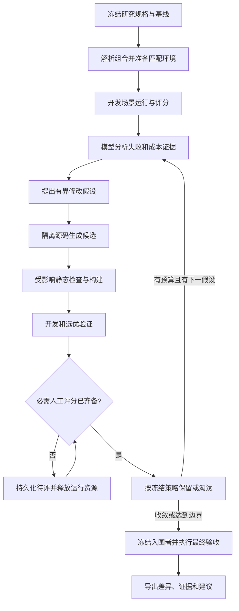

# AgentBase Evo 技术方案

## SOL-001 方案职责与当前边界

- 状态: proposed
- 来源: [需求](requirements.md)、[用户设计](user-design.md)及已完成的源码研究
- 关联: REQ-001, REQ-002, REQ-003, REQ-004, REQ-005, REQ-006, REQ-007, REQ-008, REQ-009, REQ-010, REQ-011, CON-001, CON-002, UDES-001, UDES-002, [GAP-001](current-state.md#gap-001-需要组合级优化但不需要替换已有逐题评测)

建议在 `development/agent-evaluation` 内增加 **Evo 组合评分与演进层**，复用现有逐题执行、独立验证和成本收据。运行可选择只评分或自动迭代；前者不改组件内容，后者允许模型修改授权内容。两种模式都消费显式选择的评测内容组，并允许人工评分。

`agentMd` 指选定的 AGENTS.md 指令资产，可包含全局和项目作用域；`skill` 包含正文、description、引用及运行脚本；`hook` 包含事件绑定和脚本；`MCP` 包含配置、服务与必要宿主配套；`工具` 包含 CLI 源码、构建产物和运行依赖；`子 agent 设置` 包含角色指令、角色模型参数和多代理编排配置；`Codex 设置` 包含被测 Codex 的适用配置键和运行选项。七类组件均可独立选择，在迭代模式下按授权面修改；空集合表示未选择，而不是继承宿主同名内容。

子计划入口为 [README.md](README.md)，当前授权阶段由需求 CON-001 维护。下述命令、数据结构和模块均为拟议接口，尚未实现或验证，不是可立即执行的使用指南；立项不表示这些技术细节已全部获得用户确认。

本文件由方案维护者按 SOL 条目局部维护，供用户和后续实施模型阅读；研究事实只在 `current-state.md` 维护，来源版本只在 `development/references/sources.json` 维护。实施前若相关源码或运行合同变化，先更新对应事实与方案，不从历史结论推断当前能力。

## SOL-002 技术取舍与职责

- 状态: proposed
- 关联: SOL-001, [OBS-001](current-state.md#obs-001-agentbase-已有逐题执行与独立验证底座), [OBS-004](current-state.md#obs-004-anthropic-skill-creator-适合借鉴局部评估与人工反馈), [OBS-005](current-state.md#obs-005-evoskill-提供实际候选搜索与版本选择), [OBS-006](current-state.md#obs-006-autoskill-提供经验维护与有限候选晋升)

选择“扩展 AgentBase，借鉴外部机制”，暂不把三个项目中的任何一个引入为运行依赖。现有 Windows 执行、成本、私有题库与恢复合同已经更接近需求；整体替换将重复建立状态、宿主适配和验证入口。后续若发现一个可独立复用且适配成本更低的模块，可在其职责内替换，保持协议不变。

| 职责 | 唯一承担者与拟议调整 |
| --- | --- |
| 模式、组合、评测组、预算与晋升策略 | 新增 `agent-evaluation/evo` 研究层；维护组件组合及评测目录，运行规格选择成员并冻结，不复制每个评测项的正文 |
| 队列、资源租约与监控 | 同一 Evo 研究层维护主机上的受管作业队列、预算预留和环境登记；调用现有 runner，不另建领域执行器或第二份结果账本 |
| 候选源码、差异与谱系 | 研究层管理隔离候选，不切换真实 AgentBase 主工作区；原组件继续拥有内容语义 |
| 指定组件的来源解析、投影、构建身份 | 扩展现有候选投影职责；SWE 默认配置也消费同一组装实现，退出原有硬编码整套复制决定 |
| SWE 单题执行、资格、patch、恢复 | 原 `agent_eval.py`、`evaluation_core.py`、`windows_verifier.py`；优化层通过适配器逐题调用，不复制 grader 或另记一份权威单题结果 |
| 路由语义与 capsule | 原 `development/skill-routing`；增加显式候选与研究输出位置接入，原默认入口仍保留原协议 |
| hook、MCP、CLI 的领域执行与校验 | 各组件原 owner；组合适配器只负责启动、输入/输出衔接和收据引用，不复制领域判断 |
| 模型进程、使用量与环境过滤 | 继续消费 `development/common` 与现有候选用量解析；只在已有消费者需要处扩展 |
| 人工评分与晋升 | 研究层持有版本化裁决，引用原始产物与评分协议；不覆盖运行结果 |
| 安装、部署与发行 | 原正式入口，研究层只导出可审查源码差异和报告 |

借鉴 AutoSkill 的经验筛选与合并/丢弃，EvoSkill 的候选谱系和失败反馈，Skill Creator 的逐项评分和人工输出比较。初版采用单一当前优选候选和少量挑战候选；不先建设大规模候选池、在线学习代理或跨项目技能商店。

## SOL-003 研究规格：选什么、改什么、比较什么

- 状态: proposed
- 关联: SOL-001, [OBS-002](current-state.md#obs-002-当前投影不能表达任意指定组合)

一次研究规格明确以下内容。机器字段最终通过 schema 固化；下表定义语义，不把当前示意字段当已实现格式。

| 输入 | 必须表达的语义 |
| --- | --- |
| `sources` | AgentBase 或其他明确授权源码的固定提交/快照；不从安装副本反推源码 |
| `mode` | `evaluate` 只评分或 `optimize` 自动迭代；执行授权分别匹配，不由是否传入候选文件猜测 |
| `component_groups` | 每个命名组合的 AGENTS 作用域与顺序、skills、hooks、MCP、工具、子 agent 设置、Codex 设置；同一配置键只由一个选定成员定义 |
| `mutable` | 迭代模式允许修改的源码路径、配置键/条目及成员增删；评分模式为空，不要求初始化搜索策略 |
| `fixed_dependencies` | 基础 shell、Git、构建运行时和未作为变量的连接依赖，单独显示；角色/Codex 设置由组件选择与可变面决定，不一律固定 |
| `runtime_profile` | 固定 Evo 控制器、评分器、宿主适配器和非变量环境；被测模型/调用参数若被明确选为变量，另由组件配置绑定到候选 |
| `eval_catalog` | 评测项与命名组的唯一目录；评测项定义 case 版本、输入、verifier、观察关系、能力与评分方式，组只引用成员 |
| `selection` | 显式激活的评测组、必要的单项包含/排除，以及它们与组件组合的适用关系；计划输出最终实际运行集合 |
| `objective` | 必须满足的约束、各任务族质量要求、允许的非劣界限、成本目标、最小有意义改善 |
| `search_policy` | 仅迭代模式使用：单轮候选数、变更类型、最大轮数、选优与无改善停止条件；统计重复在两种模式的运行协议中分别声明 |
| `budget` | 全研究及单次 Token/费用估算/时间/模型调用/磁盘/并发额度，人工等待期限与到期动作 |
| `execution_policy` | 主机总量与本研究并发限制、各适配器资源需求、排队/超时/暂停策略；独立评测可并发，共享资源按 SOL-013 调度 |
| `environment_policy` | 兼容身份、冷/热模式、允许复用与重置的状态、活跃/空闲池上限、磁盘水位及证据保留；按 SOL-004 组装 |
| `measurement` | SOL-009 指标的采集来源、计数边界、分组聚合与缺失处理；性能比较冻结并发和缓存条件 |
| `human_review` | 哪些评分项必须人工判定，何时提交、如何处理分歧、何种决定必须再次询问用户 |

数值额度只在 `budget` 定义；执行与环境策略引用相应额度，说明如何使用和释放，不维护第二套同名上限。主机受管总限额来自共享调度配置，单个研究只申请其内的额度，不能覆盖其他研究的资源约束。

组合必须包含实际依赖闭包。解析器可以提出“缺少 source-query 所需 srcq”等补全建议，但不得静默安装或引入未选内容。路径和同名 skill/config 冲突在组装前显示；需要选择的语义冲突交回规格维护者。

AGENTS 不能只按文件名串接：规格区分作用域、注入位置和顺序，运行收据记录实际解析方式。沿用当前 SWE 的 `developer_instructions` 投影时，明确其证据只覆盖该加载方式；要声称桌面原生 AGENTS 链行为，需对应宿主的真实运行证据。

不同组合分别有基线。例如 G1 可为“全局 AGENTS + 编排 skill + 固定角色”，G2 为“全局 AGENTS + source-query + srcq”，G3 为“全局 AGENTS + 事件记录 skill/hook + 指定 MCP/CLI”。同一源码修改可能影响多个组合；先计算实际依赖影响，纳入已授权的受影响组合和相近非触发场景，不穷举所有成员的笛卡尔积。

默认只优化固定成员的内容。选择启用/禁用、增删或替换组件属于另一个显式搜索维度，只有规格允许时参与。多个组合可以共用候选资产，但不能因修改 G1 的共享 AGENTS 而忽略 G2 的退化，也不能把任务不同的组合强排为同一排行榜。

子 agent 配置与 Codex 配置可能定义同一 `[agents]` 或 feature 键，解析器按来源与精确键发现冲突，不以覆盖顺序静默选择。用户可将允许的设置声明为候选变量；其余键固定。认证、信任哈希和宿主自动状态不进入可移植候选；实验只写研究工作区，不查询或修改当前对话的设置。仅将推理深度纳入可描述字段不授权自主调档，若要研究该字段，需用户明确指定相应研究范围。

## SOL-004 组装、运行与身份

- 状态: proposed
- 关联: REQ-010, SOL-003, [OBS-002](current-state.md#obs-002-当前投影不能表达任意指定组合), [OBS-003](current-state.md#obs-003-路由hooks-和-mcp-已各有专项职责), [OBS-008](current-state.md#obs-008-代码读取评测已有成本观测与有界环境准备合同)

组装先输出可审查的 resolved manifest：最终成员、依赖、来源、注入位置、预计副作用、构建/运行入口、未满足能力。通过后才准备研究工作区；所需软件不存在时报告前置条件，不自行升级真实主机。

| 对象 | 组装方式 | 最低充分证据 |
| --- | --- | --- |
| AGENTS | 按明确作用域生成本次运行的配置或原生规则路径 | 来源与实际加载面身份；适用任务中的行为证据，不要求模型复述规则 |
| 子 agent 设置 | 从选定角色和多代理配置生成当前候选；只允许改动声明的键与角色内容 | 运行时角色可见、实际创建/复用和适用参数证据，不根据文件存在推断生效 |
| Codex 设置 | 将选定适用键投影到被测运行；与 Evo 自身固定配置、宿主私有状态分开 | 请求配置与实际有效配置、行为的对应证据；被覆盖或不支持的键显式报告，不标作已测试 |
| skill | 从选中源码解析正文、引用和运行资源，复用项目 payload 选择合同；不整树复制安装态 | 实际可发现集合、资源解析、需要时的读取/调用事件及任务结果 |
| hook | 绑定选定事件和脚本，将路径解析到研究产物；使用相应宿主正式加载方式 | 真实事件触发、脚本退出、上下文/状态变化、顺序/超时与清理；手工喂事件仅证脚本合同 |
| MCP | 构建或选择固定 server/companion，绑定专属工作区与 Provider；不复用用户正在工作的窗口 | initialize/tools/list、相关真实调用与状态读回；schema 不等于工具执行成功 |
| 工具 | 经组件正式构建入口产生候选二进制，用每次运行的 PATH/明确入口选择，绑定完整包及运行依赖 | 实际解析路径、包身份、版本和消费者调用结果；不能退回宿主旧安装后仍报告候选通过 |

分别维护三个身份：候选源码身份、构建/投影身份、实际执行身份。收据绑定三者，防止“新源码 + 旧二进制”、未选 skill 混入、hook/MCP 未加载或路径回退。哈希与绝对位置在本机机器记录内，模型摘要只显示 C1/G1 等短别名及有意义差异。

候选不可修改自己的固定投影；执行前后核对选定资产及产物。若任务自身必须编辑这些保留路径，适配器要选择另一种有明确加载依据的布局，不能覆盖题目原有内容。

### 环境复用与有界准备

复用分为三层，均由现有投影/准备职责执行，Evo 只统一身份、租约和预算：

| 层 | 复用与隔离方式 |
| --- | --- |
| 不变来源与依赖 | 固定 Git 对象、依赖包和内容寻址构建产物按身份共享；相同构建键只准备一次，其他作业等待该产物，不各自复制完整工具链 |
| 可写执行环境 | 使用有上限的工作区槽位，按来源/依赖、投影 recipe、运行配置及宿主能力匹配；同时只租给一个作业。并发需要独立可写状态，串行可在验证重置后复用同一槽位 |
| 尝试证据 | 每次执行独立记录事件、差异、产物和收据引用；完成后保存足以评分、恢复及复核的证据，再释放槽位。不以保留整个工作区作为默认归档方式 |

排队时只登记描述，不为每个待执行项预建环境。固定候选和构建缓存按内容身份复用；只有身份/来源、输入、运行与评分协议均适配的旧收据才可复用为结果，规则见 SOL-009。共享环境不代表共享上次对话、模型上下文、作答文件、hook 缓存或 MCP 可变状态。

各适配器声明可保留缓存、需重置路径、进程/服务状态及重置后观察。槽位切换时只恢复受管差异，不做全目录删除重建；无法证明状态干净的槽位隔离并报告原因，按预算修复或重建。可写规则、配置与题目文件不得通过硬链接连到真实安装、来源或其他候选；不整树复制 Codex、插件缓存或外部参考仓库。

原生编译输出、索引和服务只有在兼容身份与重置合同成立时复用。初版优先复用磁盘依赖和槽位；VS Code/Provider 等有状态进程默认在作业后关闭，只有对应适配器证明会话清理与健康检查后才允许留在受管池中。闲置池有数量/体积/存活期限，暂停或退出释放运行租约；不接管用户已有服务或窗口。

准备前检查主机受管总占用、在途预留、新增估计和实际空闲空间，不只限制单次复制。配置活跃槽位、缓存及证据的预算和最低空闲水位；无法容纳时先排队或暂停准备，不反复尝试复制。证据达到保留预算时暂停新增工作并提示归档，不能自动删除必需结果来维持吞吐。

回收只作用于无活跃租约、无保留引用且可重建的受管缓存/槽位，按容量或闲置条件批量回收，保留常用环境；记录复制/删除字节与准备耗时。已被淘汰候选可只保留固定 base、patch、recipe 和必要证据，避免每个历史候选常驻完整 checkout。模型报告占用估计/实测与复用命中，不能把逻辑目录大小相加冒充共享资产的物理占用。

继续采用现有受信任本地开发模型。工作区和收据分离不是操作系统安全隔离；如果场景要求证明无法读取隐藏答案或必须限制外部访问，只有具备已验证边界的适配器才可执行该类声明，不能用提示词或“未挂载”冒充访问控制。

## SOL-005 评测分组、场景和评分适配器

- 状态: proposed
- 关联: REQ-005, REQ-006, SOL-002, SOL-004

评测目录将“项”和“组”分开：每个评测项有稳定 ID 与版本，组有名称、说明和成员引用。支持新增/修改/删除组、增删组成员及评测项；删除仍被引用的项须先调整引用，不能形成悬空选择。一个项可以被多个组引用，运行计划按项版本、组件组合、输入、评分协议和 replicate 去重，重叠分组不能导致重复收费或在总体统计中重复计数。

选择激活只决定本次运行集合，不改评测正文。可以保存命名选择集，运行时明确采用哪一份并冻结结果；未激活的组不参与执行、准备或汇总门槛，不触发其依赖安装。组与组件的适用关系显式声明，不默认做全组合乘积。没有激活项时只返回空计划，不能报告评测通过。

例如，评测目录可包含“指令与路由”“子代理协作”“hooks 生命周期”“MCP/工具任务”等组，使用者按需求增删和选择；这些只是示例，不固化为唯一分类。真实目录和题目留本机，Git 可分发不含真实题目的分组 schema 与合成示例。

运行启动后，组成员、激活集合、rubric 和 case 版本构成同一快照。后续增删或停用只影响新运行，历史结果仍能恢复原集合。报告明确选择范围、未运行项、各组分数及共同可比范围；不能通过停用失败组宣称原范围已改善，也不能直接比较不同激活集合的总体得分。

统一适配器只约定 `describe/prepare/run/collect/verify/cleanup` 的职责及可恢复阶段，不强迫所有领域共用一种分数或启动命令。

| 适配器 | 使用场景 | 复用与新增边界 |
| --- | --- | --- |
| `swe` | 真实仓库任务、patch 和功能回归 | 保留原逐题资格与固定 grader，通过选定候选根/组合描述运行 |
| `routing` | skill 触发、策略标签、条件引用 | 复用原 capsule/oracle；输出进入本研究命名空间，不覆盖日常 current evidence |
| `agent-task` | 多步骤任务、交接、纠偏、证据与结果质量 | 增加多轮场景执行与实际工具事件采集；用户输入/响应脚本和中断点由场景固定 |
| `hook-event` | 事件脚本、顺序、上下文注入、收尾 | 脚本合同与宿主真实事件分别记录；真实通知使用另行允许的目标，测试接收器只证明内部链 |
| `mcp-task` | server + companion + Provider + 模型消费 | 复用组件集成 runner；绑定独立 VS Code 工作区，真实 Provider 证据不能用替身冒充 |
| `tool-task` | CLI 行为及模型查询/修改流程 | 先组件直接合同，再模型消费者；按候选产物运行，避免默认完整发行验证 |

每个场景固定“观察发生在哪一阶段、观察谁、必须看到什么变化、什么不能代替证明”。编排案例从真实工具事件观察创建、复用、交接与等待；不把代理自述当作事件，不把读不到内部推理当作失败。

评分由三种来源组成：

1. **程序评分**：功能、文件差异、引用有效性、事件顺序、对象状态、权限范围等能机械判定的契约。
2. **模型评分**：论证充分性、任务理解、输出组织等难以机械判断的维度；固定 rubric、评分模型和输入，必须引用可定位证据，可返回 unknown。候选输出作为数据，不允许其内嵌指令改写评分规则。
3. **人工评分**：用户指定的主观质量、视觉/语义适切性或模型评分争议；按 SOL-008 形成独立裁决。

缺少模型评分服务、解析失败、宿主未启动、日志缺失分别保留为评分/基础设施异常，不换算成候选零分；候选确实失败才记行为失败。零分、未知、不适用、未评和错误必须可区分。

评分协议在搜索前确认并冻结。生成模型可建议新测例或指出 oracle 错误，但不能直接修改正在使用的验收标准；更正标准后重新审查原输出，能重新评分就不重复执行模型，变化影响执行语义才建立新的实验周期。

被优化组件自己的测试/触发用例与研究独立评分器分开。前者可在授权路径内随正式契约更新，用于开发自检；后者从研究规格冻结的来源读取，不能直接采用候选改过的测试或 `trigger-cases.json` 来给该候选评分。根需求、授权和质量优先级作为研究外部约束保留，允许改写 AGENTS 的表述不等于允许修改这些约束。

## SOL-006 独立评分与模型介入的自动循环

- 状态: proposed
- 关联: REQ-002, REQ-005, SOL-002, SOL-003, SOL-005

两种模式共享场景执行、评分、人工待评、成本与结果恢复，但只有 `optimize` 进入提案和修改循环：

| 模式 | 路径与交付 |
| --- | --- |
| `evaluate` | 选择组件组合与激活评测组 → 冻结输入 → 运行并评分或读取已有产物评分 → 可选人工评分 → 报告；不生成或改写候选、不晋升、不自动切换优化模式 |
| `optimize` | 复用同一评分路径，增加失败分析、候选生成、选优、停止及最终验收，受显式可变范围和搜索预算约束 |

独立评分可以只评一个组合，无须提供基线、可变面或搜索配置；也可以比较多个已给定版本。对已有产物进行评分时，绑定原产物与运行来源，不重新启动 subject；缺少必要证据时返回不完整评分，不能偷偷补跑。模型 grader 仍可能消耗 Token，按评分调用授权和预算记录；程序或人工即可闭合时不强制调用模型。

以下循环图只适用于 `optimize`。`evaluate` 在评分和报告后结束，必需人工输入暂缺时按 SOL-008 暂停恢复。

模型承担提案、实现和分析，不成为唯一评分者。优化控制器使用固定指令、工具与运行合同；不能加载候选 AGENTS 来决定自身授权，也不能让候选修改 controller、grader、隐藏测试、预算或人工结果。

一轮以一个有依据的机制为单位，可以跨该机制所需的多个文件，例如同时修正 skill 的描述、正文及必要脚本；不是强制单文件补丁。提案包含现象、直接证据、假设、允许触及的成员/路径、预期改善、可能退化及可证伪条件。实现失败只在既定修复预算内继续，涉及新增公共职责、弱化验收或超出成员范围时暂停依赖部分，交由用户/维护模型裁决。

候选源码在隔离 checkout 中修改，冻结后供 subject agent 使用。subject agent 执行题目；其作答 patch 和优化器修改 AgentBase 的 patch 是两种独立产物。冻结候选产生后不能继续编辑它，否则生成新候选身份。

开发反馈按当前假设投影：摘要、必要反例、来源位置和关联差异；失败轨迹需要时渐进读取。保留有价值的失败候选，避免重复提出相同内容，但不复制全部对话为长期技能。补充真实经验必须经显式导入和适用性筛选，不自动扫描日常全部会话。

初版优选策略是“固定基线 + 当前优选 + 有界挑战者”，优先完成一个挑战者的完整证据链。候选已冻结、前提已证的独立评测可按 SOL-013 并发，不要求整轮串行；依赖当前评分的下一轮提案不能抢跑。只在独立候选确有收益且资源允许时并行生成；不因程序具备多代理能力而固定串联多个模型。提案者、实现者、评分者是流水线职责，不要求新建 Codex 自定义角色。

## SOL-007 对照、数据划分与晋升

- 状态: proposed
- 关联: SOL-005, SOL-006

自动迭代的数据分为开发集、选优验证集、最终验收集。开发集可向提案模型提供详细失败；验证集用于候选筛选，其结果进入研究反馈时也视为已使用的数据；最终验收在搜索停止、入围候选和评分协议冻结后执行。按项目/任务家族/轨迹来源分组划分，避免同一问题的改写版本跨集合泄漏。样本不足时只报告局部实验，不宣称泛化改善。独立评分不要求人为拆成三个集合，只按激活集合及其已有用途标签报告；选择分组不能洗掉案例已参与开发/选优的历史。

最终验收的失败可以促成后续研究，但一旦其具体反馈用于改写，该批数据在后续周期中就降为开发/验证数据；不得继续称作未见验收集。真实题目、答案、人工逐项结果和原始轨迹都留本机，Git 只保存框架、合成示例和可公开的方法结论。

比较版本时，除明确声明的组件/设置变量外，模型、工具、宿主、依赖、激活场景及缓存策略必须匹配。子 agent 模型或 Codex 参数被用户明确选为变量时，允许按冻结实验设计比较，结果归因于包含该变量的组合，不冒充纯文本改进。冷/热缓存分开定义，说明具体是依赖、构建、索引还是模型前缀缓存；不能为追求复用率把规定的冷启动变成热启动。AB 顺序可平衡，重复次数在启动前固定，重用 seed 也不代表模型确定性。局部试点可采用少量重复，但结果必须保留离散程度与样本量；不能只挑最佳一次。

并发提升整批吞吐，不直接证明单次延迟改善。性能对照固定资源/并发档案并记录实际竞争与限流；延迟比较需要时使用独占或匹配负载的测量通道。两组条件不匹配时仍可报告各自观测，但不归因为组件收益；排队时间、任务执行时间和整批墙钟时间分别呈现。

晋升仅属于自动迭代模式，按研究规格逐级判断；独立评分保留同一证据维度，不强制选出赢家：

1. 身份和执行证据完整；无越界修改、缺失必需能力或不可解释的评分异常。
2. 必须遵守的行为契约满足；尚未满足时可保留为“有进展”，不能作为已合格版本。
3. 各必需任务族的质量达到门槛，并相对原始基线及当前优选满足预先声明的非劣要求；不能让容易题的增益抵消关键族退化。
4. 质量同等充分时比较完整 subject 及后代 Token/成本；前者不退化再比较耗时。最小改善幅度和统计不确定性一起报告，不依据浮点分数微小变化自动晋升。
5. 必需人工评分已完成且无未决冲突。

不预设跨任务的单一加权总分。质量、约束、覆盖、成本和速度保持证据向量；语义或主观差异无法按已确认策略裁决时，保留不可直接比较的候选，交给人工选择。

整个组合改善并不证明每个成员分别有效。只有影响采用决定时，增加移除/替换一个成员的消融对照；相互依赖成员需成组比较。不把完整组合得分外推为所有未测组合的收益。

## SOL-008 人工参与与暂停恢复

- 状态: proposed
- 关联: SOL-005, SOL-007

研究规格可以选择全自动评分、混合评分或人工主导评分。人工介入发生在三类位置：确认目标/rubric；评价指定输出；裁决范围、oracle 或不可比较候选。已经授权范围内的普通候选无需逐步审批。

初版提供可离线阅读的评审包和结构化评分导入，不以建设完整 Web 应用为前置。评审包按案例展示必要输入、候选输出/截图、rubric、可定位证据；适合盲比时使用 A/B 标签，提交前隐藏候选来源与成本，避免影响质量判断。引用完整产物，不嵌入全部执行日志。

一份人工裁决绑定研究版本、候选、运行产物、案例和 rubric 版本，包含每维评分、依据及 `accept/reject/tie/unknown/abstain`。空值是未评，提交完成是明确操作，沉默不视为通过。更正裁决追加 supersedes 关系，不篡改既有评分记录；争议按规格交给指定裁决者，不自动取有利分数。

必需评分缺失时，该次评估处于 `awaiting_human`；独立评分可以报告已评部分但不能声称完整评分完成，迭代模式中的候选不能晋升。调度器可以完成不依赖该评分的已授权工作，随后释放模型、服务和工作区运行资源，以持久状态返回；不保持模型空转等待。用户可在后续任务导入评分并继续。超时默认暂停，不默认为接受或拒绝。

反馈只影响其绑定范围。候选或输出变化须重评受影响项；仅摘要展示变化不使原判定失效。若人工意见实质改变了需求或评分标准，形成新协议版本，并在可复用原产物的范围重新评分。

## SOL-009 成本、尝试与恢复

- 状态: proposed
- 关联: REQ-009, REQ-011, SOL-006, SOL-008, [OBS-001](current-state.md#obs-001-agentbase-已有逐题执行与独立验证底座), [OBS-005](current-state.md#obs-005-evoskill-提供实际候选搜索与版本选择), [OBS-008](current-state.md#obs-008-代码读取评测已有成本观测与有界环境准备合同)

### 指标与比较口径

沿用代码读取优化的“先质量与完整证据，再总 Token，再耗时”，不把专项指标强加给所有评测组：

| 维度 | 记录与报告 |
| --- | --- |
| 质量与覆盖 | 场景结果、证据完整性、适用 rubric、各组通过/失败/未评/异常及样本数；关键约束不被平均分抵消 |
| 实际模型用量 | 主代理及全部后代逐请求输入、缓存读取/写入（若提供）、输出、推理输出（若提供）和总量，保留原始计数及解析版本 |
| 局部上下文成本 | 对命令、工具返回、实际读取的规则/skill 等用声明的 tokenizer 计数；代码读取组可沿用每目标 Token。计入失败、回退和首次加载，不与 API 用量相加 |
| 时间与吞吐 | 排队、准备/构建、subject 执行、验证、评分和人工等待分开；报告单项耗时分布、整批墙钟时间和单位时间有效完成数，并列失败/异常数 |
| 执行行为 | 按场景需要统计工具调用、失败回退、重试、压缩、子代理创建/复用/等待及关键纠偏；调用更少或代理更多都不直接作为质量结论 |
| 资源效率 | 环境/构建/结果复用分别计数，准备与重置耗时、复制/删除量、受管磁盘当前值及峰值；无法精确采集时注明估计或未知 |

指标先按评测项、组合、replicate 与冷/热条件保存，再聚合到组；总体按去重执行集合汇总。报告中位数、样本数和离散程度；小样本不包装成稳定收益，性能无可比条件时不排名。失败和未完成的实际消耗仍进入研究总账，并与成功样本成本分开显示。

输入总量与其缓存子类、输出总量与其中推理输出不能重复相加；逐请求记录与会话累计更新也不能相加。适配器声明计数覆盖范围并对账；若父级汇总已含后代，不能再叠加后代明细。缓存命中率明确分母；缺少请求级来源或口径不一致时，不能从累计值推导精确命中收益。“理想缓存”仅在能满足原代码读取评测前提时作为独立反事实分析，不替代实测成本或作为默认晋升依据。

### 代理调用链与用量归属

执行适配器采集实际创建、复用、续调、结束和请求用量事件，研究层统一引用。每条调用绑定研究/作业/attempt、代理和 turn/request，记录父代理及发起者、角色、请求模型与实际模型、开始/结束时间、退出状态、用量来源和完整性。角色配置只表达预期；实际模型拿不到时保留 unknown，不能用配置补成已观测值。工具只返回累计值时按同一会话的连续计数区间求增量，遇到重置或缺口停止推算。

创建关系与协作关系分开：父子树说明代理来源，复用、消息和交接事件说明谁在何时使用谁。一个代理可被同一评测中的多个代理复用，费用按实际请求归属一次；不能把整个代理会话总量反复加给每个调用者。初版默认不跨独立评测项共享有上下文的代理，以免题目与候选污染；若场景本身要求跨轮复用，将这些轮定义为同一个有状态评测单元。将来允许跨作业协作时，必须先有请求级归属与上下文隔离合同，不按消息数猜测分摊。

输出同时提供整次评测总量、按角色/模型/代理的明细和调用关系，主代理与后代可分别展开。代理并行时，各自活动时长可累加为资源时间，但不能相加冒充任务墙钟时间。评分器、提案者和实现者另归研究阶段，不能混入 subject 的使用成本。配置有角色但没有创建事件，与运行事件缺失是两种不同状态；后代用量不全时标记覆盖缺口，该样本不能进入完整成本排名，但已有质量证据仍可报告。

主代理返回不代表所有后代已结束。结束或取消评测时，适配器收拢本次调用链并对账；仍有运行中或用量未决的后代时保留资源/费用预留和待结算状态，不提前宣称最终总成本。

### 总账、预算与恢复

分开报告两笔成本：**使用成本**是 subject 完成任务及全部后代消耗；**研究成本**是本轮真实发生的全部运行与评分支出，在迭代模式下还包含提案、实现及失败候选支出，按角色/阶段拆分避免重复相加。独立评分不产生提案与实现费用。人工时间单列。API 等价费用使用冻结价格来源，不冒充订阅实际账单；缺失用量是 unknown，不能填零参与省 Token 排名。

精确复用已有执行收据时，保留其历史任务使用成本供质量/效率比较，但本轮新增模型调用成本为零；不得把旧收据用量再次累加到研究实际支出。缓存证据必须绑定相同可见输入、运行身份和原始来源，复用也不能充当新的独立统计样本。

预算覆盖实际选择路径的总模型调用/Token、每次超时、构建时间、磁盘与并发，费用作为可计算时的补充；最大候选/轮数只用于迭代模式。已有产物评分不要求 subject 运行额度。启动子工作前预留其额度，结算后释放；外部调用无法保证即时止损时记录可发生的有限超额，无法取得可靠用量时暂停新的模型派发，不能悄悄继续无上限搜索。

停止条件包括预算耗尽、连续无有意义改善、重复同一候选/失效假设、当前能力不支持、需要用户裁决或最终验收完成。停止输出已有证据，不把预算耗尽包装成优化完成。

独立评分的生命周期是 `planned → evaluating → awaiting_human（如需）→ concluded`；自动迭代为 `planned → baselining → searching → awaiting_human（如需）→ finalizing → concluded`，两者都可 `paused/cancelled/blocked`。只在迭代模式维护候选的 `proposed/materialized/checking/evaluating/awaiting_human/eligible/rejected/invalid` 状态，不把研究暂停解释为候选失败。

研究层只持有候选关系、调度决策、预算和单次结果引用；单次原始收据仍归执行适配器。每次外部调用前登记 attempt，进程退出后原子结算，保留调用身份和使用量。恢复时核对进程、产物与收据：模型已有结果则继续验证/评分，身份不变则复用，身份漂移则明确失效范围。

现有 SWE 对相同运行身份复用结果，现有路由也禁止同输入刷分。要支持统计重复，必须显式增加预先登记的 replicate 槽位和对应 receipt 身份；replicate 与错误重试是不同字段。旧调用保持单次语义，不能借改变候选别名、研究编号或 `retry_reason` 绕过旧限制。基础设施重试继续有明确原因和限额，行为失败不自动重跑。

## SOL-010 存储、模型交互面与候选导出

- 状态: proposed
- 关联: SOL-002, SOL-009

| 内容 | 真源、消费者与恢复 |
| --- | --- |
| 研究规格 | 本地研究 JSON 维护模式、组件选择、评测激活集合和预算，引用评测目录与评分版本；模型按稳定别名修改，用户审阅，启动时生成不可变运行快照 |
| 评测目录 | 本地 case 定义与组成员关系分别维护；目录管理入口增删组/项并检查引用，激活选择只引用目录；历史运行消费冻结快照，不随目录删除而丢失来源 |
| 源码候选 | 隔离 Git checkout/commit + 相对固定来源的 patch；实现模型只修改允许面，重建时由固定 base 与 patch 恢复 |
| 构建/投影 | 从候选和固定 recipe 生成，机器 manifest 记录文件与依赖；缓存可重建，不直接编辑 |
| 原始执行与评分 | 本机单次不可变收据、产物、事件、用量；适配器持有权威事实，研究层只引用 |
| 人工裁决 | 与产物和 rubric 绑定的版本化记录，只有评分导入入口更新；不改写机器观察 |
| 研究状态 | 调度状态、预算与收据引用，原子更新；故障后从原始收据对账，不把模型摘要当 checkpoint |
| 环境与资源登记 | 同一 Evo 状态库持有缓存身份、槽位/服务租约、预算预留和引用；适配器报告实际资源。启动恢复先对账，孤立或状态不明的资源暂不可复用 |
| 代理与请求事件 | 执行适配器持有原始事件及来源，研究层按调用身份关联；模型只读短别名、模型/角色、关系、增量用量和缺口，明细按需展开 |
| 模型反馈与报告 | 由以上记录按当前责任投影；必要时按短别名展开原文，可重建，不接受反向编辑来改变分数 |

框架源码、schema、合成用例可提交 Git；真实研究规格、题目、答案、原始事件、截图、评分及本机路径放在仓库外的研究 state root。work root 保存可清理工作区，与 state、项目仓库和真实安装根分离，沿用现有评测的路径约束。参考源码仍由 `development/references` 管理，不混进候选或题目工作区。

模型默认读取本轮差异、关键失败/改善、评分缺口、成本和下一动作；按需取得单项证据，不反复发送完整运行历史。完整机器记录与简洁视图来自同一事实，不维护第二份分数或手写运行摘要账本。

独立评分导出组合和有效设置、激活组/实际评测项、程序/模型/人工评分引用、成本、未评与不确定性；有可比基线时才报告改善或退化。自动迭代在此基础上另导出源码 patch、候选谱系和构建要求。源码主线已变化时先复核整合冲突及受影响验证；整合形成新候选，不能继续沿用不同源码的通过结论。

研究内 `eligible` 仅表示符合该研究晋升条件；应用到 AgentBase 真源按用户已授予的项目修改/Git权限处理，写入真实 Codex 安装或发行始终使用独立授权与现有正式入口。优化器不直接 Deploy/Release，也不修改当前任务的推理深度。

## SOL-011 接入步骤与兼容性

- 状态: proposed
- 关联: SOL-002, SOL-004, SOL-005, SOL-009, SOL-013

拟议主入口统一为 `agent_eval.py evo <动作>`，规格明确 `mode=evaluate|optimize`；动作分为只读 `plan/status/watch/report`，评测目录 `eval-group/eval-case` 的增删维护与激活选择，显式执行 `prepare/run/resume/score`，作业控制 `pause/cancel`，人工 `review-export/review-import`，以及迭代结果 `export-candidate`。`score` 只消费已有产物，所选模型评分仍按授权计费；目录维护与只读计划均不启动模型、安装依赖或加载宿主。关闭 `watch` 只结束监控，不取消作业。旧方案中的 `optimize` CLI 从未实现，不保留同责别名。

| 阶段 | 交付结果 | 验证与退出条件 |
| --- | --- | --- |
| 1. 规格、组合与评测组 | 表达七类组件、固定/可变面、模式、评测组增删及激活；在一个 AGENTS+skill 组合上接入原 SWE 投影 | 合成验证设置键冲突、依赖缺失、产物错配、重叠组去重、空选择和目录变更后的历史恢复；旧 SWE 默认命令行为不变 |
| 2. 独立评分与可恢复比较 | 无需搜索配置即可评分既定组合；接入有界队列、进度监控、环境租约与复用、调用链成本、已有产物重评及人工暂停恢复 | 先 evaluator 禁用的合成作业和故障注入，覆盖 SOL-013 调度及 SOL-004 复用合同、父子/复用调用去重、缺失用量不填零；另获额度后完成真实运行→评分→报告，证明未激活组不执行、重评不重跑 subject，并核对真实后代模型及用量 |
| 3. 其余组件纵向接入 | 接入子 agent/Codex 设置变量、hook、MCP 和工具；至少一个七类内容同时启用的组合完成端到端任务 | 验证设置真实生效、角色真实使用、hook 真事件、MCP 真调用和候选工具真二进制；任一缺失就不能宣布完整组合支持。桌面专属能力不能由 CLI 结果代替 |
| 4. 有界自动迭代与多组合 | 多轮提案、候选筛选、预登记重复、受影响组合复核、停止与最终验收 | 验证不重复执行已完成模型、预算预留、必需人工评分缺失不晋升、同源案例不跨集、退化不被平均分掩盖 |

阶段 1—2 先交付可独立使用的评分能力。完整目标仍包括阶段 3 的七类内容组合与阶段 4 的自动循环；实现任务另行授权后才建立。

具体兼容处理：

- `agent_eval.py` 原有 `validate/list/prepare/oracle/run/recover/report` 和本地 corpus 继续有效；旧默认整体候选在内部解析为 legacy 组合，不要求用户改原命令。
- 将硬编码整套投影改为消费 resolved composition，原实现退出，保留默认映射；新增空 skill/无角色组合仅适用于明确选择的新协议，不能反转旧能力合同。
- 新组合及 replicate 收据使用新身份/版本；历史结果保持可读，但不能假装已经覆盖 hooks/MCP/候选工具或统计重复。现有 reader 需显式处理新版本，不能默默丢失身份字段。
- 路由研究新增候选和结果位置注入后，日常默认值保持原路径；优化期间不覆盖现有 `evidence/current.json`。先定义重复实验合同并更新其唯一 owner，不旁路调用内部 evaluator 来绕过尝试限制。
- tool/MCP/hook 接入只调用各组件受影响验证，不把完整 Release 检查挂到每轮候选，也不把优化结果加入 Deploy/Status 门禁。
- 模型交互面扩展需核查读取充分性、修改唯一真源、机器 schema 与派生物恢复；相关基础设施正式回归只在实现稳定后按实际影响范围运行一次。

## SOL-012 首个试点和方案完成边界

- 状态: proposed
- 关联: SOL-006, SOL-007, SOL-011

建议先以“全局 AGENTS + subagent-orchestration + 固定四角色配置”为试点，限定修改编排 skill 及其确有必要的规则关联，角色模型和运行参数固定。场景覆盖已有证据可直接用、需要独立搜索、共享 evidence 正忙、交接后结果送达、重要决定需纠偏、阶段验收理解，以及无需委派的相近简单任务。判断任务结果、返工和总成本，不以更多 evidence 或更少消息为目标。

先以独立评分模式跑通所选协作评测组，再按授权增加迭代。试点暂时固定角色/Codex 参数只是控制变量，不限制框架对两类设置的支持；随后接入明确允许的设置变量、“source-query + 候选 srcq + MCP”和事件记录 hook，完成一个七类组合的真实场景。各阶段的模型额度、人工 rubric、外部副作用和激活评测组在运行前明确；本方案不替用户默认开启收费评测、通知或真实宿主变更。

本方案完成表示：来源已固定、源码事实已核对、职责/组合/评分/人工/恢复/迁移已有可审查设计。它不表示自动优化已经可用，也不保证候选必然改善。子计划名称与层级已确认；具体技术方案的采纳、实施范围及首轮运行预算按后续用户裁决推进。

## SOL-013 有界并发队列与进度监控

- 状态: proposed
- 关联: REQ-007, REQ-008, REQ-011, SOL-004, SOL-005, SOL-008, SOL-009

### 调度与限额

初版采用本机持久队列与普通程序调度器，不要求常驻模型或分布式集群。已授权 `run/resume` 驱动队列，`status/watch` 可另行读取；监控不持有执行许可。一个本机调度根统一登记所有 Evo 研究的受管资源，通过单一活动调度租约和原子领取避免多进程重复派发；单项执行及事实收据继续归原适配器。

作业绑定冻结计划中的候选/组合、评测项及输入版本、评分协议和 replicate，执行阶段是恢复游标，attempt 另记；阶段推进不产生新的评测身份。只有输入就绪、前置验证成立且预算/资源满足才可领取。初版按就绪先后公平调度，受某项资源阻挡时允许其他资源独立的作业继续；环境复用的亲和选择不能让旧作业无限等待。冻结范围内按需生成就绪项，不提前展开无限候选或为每个排队项占用磁盘。

| 限制 | 执行含义 |
| --- | --- |
| 评测作业并发 | 主机受管总上限与研究自身上限共同生效；排队和纯人工等待不占运行槽位，不能每项各启动一个带完整上限的调度器 |
| 模型容量 | 分别约束 subject、评分和提案等模型工作，并覆盖 subject 后代。根作业数不等于模型会话数；派发前按声明的最大代理占用预留，子代理仍是原作业的一部分，不排到可能被其父占满的根作业队列 |
| 领域资源 | 编译 CPU/内存、环境槽位、磁盘准备与 VS Code/Provider 等独占资源由适配器声明；共享资源互斥，无冲突的 CLI 作业可并行 |
| 外部配额 | 对可观测的服务限流按有界退避重新排队；Token/费用预算与并发容量分开核算，不能用有空槽替代剩余额度 |

并发上限由用户配置和适配器能力共同约束，不在方案里硬编码一个适合所有组合的数值。宿主无法控制内部模型请求时，只能声称已实施根作业/已证会话限制，不能承诺请求级硬上限；用户要求的严格上限若无法保证，相关组合在准备阶段报告不支持。不得为满足限额静默关闭被测子代理、改变模型或修改候选设置。

### 状态、恢复与控制

作业阶段为 `queued → preparing → running → verifying → grading`，按适配器可跳过不适用阶段；另有 `awaiting_human/paused`，终态区分 `completed/failed/cancelled/invalid`。阶段附带排队/暂停原因、持有资源和最近事件时间；`completed` 表示执行与评分流程结束，候选是否通过由评分字段表达。研究生命周期仍由 SOL-009 维护，作业阶段不能替代研究或候选状态。

领取与预算预留原子登记，外部调用前写入 attempt，执行后按收据结算并释放租约。恢复先检查本次拥有的进程及其启动身份、心跳、收据与可写环境；不能仅因心跳过期就释放仍在使用的槽位，更不能重新启动一个结果不明的模型调用。未决调用留待对账，其他无关作业继续；已有结果直接进入验证/评分，不再调用 subject。

`pause` 停止新增派发，默认让在途工作在可恢复阶段结束；`cancel` 取消未运行项，并由适配器处理指定在途作业及其后代，保留已花成本与已有产物。只终止本次拥有且身份已核对的进程，不按进程名称批量关闭 Codex。人工待评释放运行槽位，只保留收据与必要评审产物；不得空转占用模型或环境等用户答复。

### 用户与模型监控面

提供同源的紧凑 `status` 和增量 `watch`，可按研究、组合、评测组、单项/代理过滤；初版终端即可直接使用，不以完整 Web 系统为前置。总体显示当前阶段、已结束/有效完成/失败/待评/排队数、运行槽位与资源、已用/预留/剩余预算、磁盘及复用情况；单项展开当前动作、耗时、等待原因、最近事件和证据位置。代理视图列出实际模型、角色、父子/复用关系、活动状态与已观测用量，详情遵循 SOL-009。

进度来自冻结的去重计划与真实事件。组内各自可统计同一案例，总体不能重复计数；执行完成率与评分覆盖率分开，未评不算通过。自动迭代只对当前已确定批次显示分母，未来轮数用上限和已消耗预算表示；剩余时间只能作为附有样本依据的估计。实时用量未结算时显示暂计/缺口，不显示伪精确总额。

监控从同一状态与原始事件做可重建投影，按变化增量读取并节流，不持续重扫全部日志或把每个工具事件推给模型。模型默认只收到重要失败、预算/资源阻塞、需人工决定及可解除实际等待的事件；用户主动打开 `watch` 时可持续看进度。日志按单项定位并有界展开，关闭监控后任务仍可按原授权执行。

### 实施时的验证闭环

先用 evaluator 禁用的合成作业验证：两个研究同时排队也不超主机限额；共享宿主互斥而独立作业可前进；后代容量不漏算且父等待子时不发生槽位死锁；领取/启动/结算中断恢复不重复执行；人工等待释放资源；关闭监控不取消任务。环境侧验证同身份复用、跨候选污染拒绝、差异重置、在途空间预留和活跃证据不被回收。监控必须能从真实状态恢复阶段与计数，调用链汇总需与原始请求对账。这些门禁只证明基础设施，真实并发、模型用量及资源收益另获额度后在最小组合中验证，不因新增指标自动扩大模型评测。
