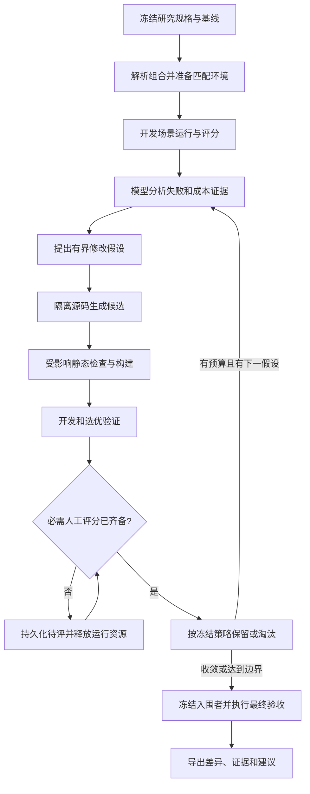

# AgentBase Evo 技术方案

## SOL-001 方案职责与当前边界

- 状态: proposed
- 来源: [需求](requirements.md)、[用户设计](user-design.md)及已完成的源码研究
- 关联: REQ-001, REQ-002, REQ-003, REQ-004, CON-001, CON-002, UDES-001, UDES-002, [GAP-001](current-state.md#gap-001-需要组合级优化但不需要替换已有逐题评测)

建议在 `development/agent-evaluation` 内增加**组合研究与优化层**，复用现有逐题执行、独立验证和成本收据。优化对象是一个明确选定的运行组合；模型可以修改授权的内容，程序执行冻结的实验协议，人工在指定评分维度或重要裁决处介入。

`agentMd` 在本文中指选定的 AGENTS.md 指令资产，可包含全局和项目作用域；自定义角色配置作为相关依赖另行选择。`skill` 包含正文、description、引用及其运行脚本；`hook` 包含事件绑定和脚本；`MCP` 包含配置、服务与必要宿主配套；`工具` 包含 CLI 源码、构建产物和运行依赖。方案允许其中某类为空，不要求每次启用五类全部内容。

子计划入口为 [README.md](README.md)，当前授权阶段由需求 CON-001 维护。下述命令、数据结构和模块均为拟议接口，尚未实现或验证，不是可立即执行的使用指南；立项不表示这些技术细节已全部获得用户确认。

本文件由方案维护者按 SOL 条目局部维护，供用户和后续实施模型阅读；研究事实只在 `current-state.md` 维护，来源版本只在 `development/references/sources.json` 维护。实施前若相关源码或运行合同变化，先更新对应事实与方案，不从历史结论推断当前能力。

## SOL-002 技术取舍与职责

- 状态: proposed
- 关联: SOL-001, [OBS-001](current-state.md#obs-001-agentbase-已有逐题执行与独立验证底座), [OBS-004](current-state.md#obs-004-anthropic-skill-creator-适合借鉴局部评估与人工反馈), [OBS-005](current-state.md#obs-005-evoskill-提供实际候选搜索与版本选择), [OBS-006](current-state.md#obs-006-autoskill-提供经验维护与有限候选晋升)

选择“扩展 AgentBase，借鉴外部机制”，暂不把三个项目中的任何一个引入为运行依赖。现有 Windows 执行、成本、私有题库与恢复合同已经更接近需求；整体替换将重复建立状态、宿主适配和验证入口。后续若发现一个可独立复用且适配成本更低的模块，可在其职责内替换，保持协议不变。

| 职责 | 唯一承担者与拟议调整 |
| --- | --- |
| 研究范围、目标、组合、预算、晋升策略 | 新增 `agent-evaluation/optimization` 研究层；由用户/维护模型编写研究规格，运行时冻结 |
| 候选源码、差异与谱系 | 研究层管理隔离候选，不切换真实 AgentBase 主工作区；原组件继续拥有内容语义 |
| 指定组件的来源解析、投影、构建身份 | 扩展现有候选投影职责；SWE 默认配置也消费同一组装实现，退出原有硬编码整套复制决定 |
| SWE 单题执行、资格、patch、恢复 | 原 `agent_eval.py`、`evaluation_core.py`、`windows_verifier.py`；优化层通过适配器逐题调用，不复制 grader 或另记一份权威单题结果 |
| 路由语义与 capsule | 原 `development/skill-routing`；增加显式候选与研究输出位置接入，原默认入口仍保留原协议 |
| hook、MCP、CLI 的领域执行与校验 | 各组件原 owner；组合适配器只负责启动、输入/输出衔接和收据引用，不复制领域判断 |
| 模型进程、使用量与环境过滤 | 继续消费 `development/common` 与现有候选用量解析；只在已有消费者需要处扩展 |
| 人工评分与晋升 | 研究层持有版本化裁决，引用原始产物与评分协议；不覆盖运行结果 |
| 安装、部署与发行 | 原正式入口，研究层只导出可审查源码差异和报告 |

借鉴 AutoSkill 的经验筛选与合并/丢弃，EvoSkill 的候选谱系和失败反馈，Skill Creator 的逐项评分和人工输出比较。初版采用单一当前优选候选和少量挑战候选；不先建设大规模候选池、在线学习代理或跨项目技能商店。

## SOL-003 研究规格：选什么、改什么、比较什么

- 状态: proposed
- 关联: SOL-001, [OBS-002](current-state.md#obs-002-当前投影不能表达任意指定组合)

一次研究规格明确以下内容。机器字段最终通过 schema 固化；下表定义语义，不把当前示意字段当已实现格式。

| 输入 | 必须表达的语义 |
| --- | --- |
| `sources` | AgentBase 或其他明确授权源码的固定提交/快照；不从安装副本反推源码 |
| `groups` | 每个命名组合的 AGENTS 作用域与顺序、skills、角色、hooks、MCP 和工具成员；显式空集合表示不启用，不默默补齐默认资产 |
| `mutable` | 允许修改的源码路径、配置键/条目、可否新增/删除成员；启用不等于允许改写 |
| `fixed_dependencies` | 基础 shell、Git、构建运行时、角色模型配置、连接方式等固定依赖，单独显示，不冒充被优化组件 |
| `runtime_profile` | Codex CLI 或已支持的桌面宿主适配器、模型及调用参数、权限/网络模式、工具版本；在研究内固定 |
| `scenario_suites` | 任务族、case 版本、公开输入、私有 verifier、目标阶段/对象/变化、适用组合、必需能力与评分方式 |
| `objective` | 必须满足的约束、各任务族质量要求、允许的非劣界限、成本目标、最小有意义改善 |
| `search_policy` | 单轮候选数、允许的变更类型、最大轮数、重复次数、选优方式、无改善停止条件 |
| `budget` | 全研究及单次 Token/费用估算/时间/模型调用/磁盘/并发额度，人工等待期限与到期动作 |
| `human_review` | 哪些评分项必须人工判定，何时提交、如何处理分歧、何种决定必须再次询问用户 |

组合必须包含实际依赖闭包。解析器可以提出“缺少 source-query 所需 srcq”等补全建议，但不得静默安装或引入未选内容。路径和同名 skill/config 冲突在组装前显示；需要选择的语义冲突交回规格维护者。

AGENTS 不能只按文件名串接：规格区分作用域、注入位置和顺序，运行收据记录实际解析方式。沿用当前 SWE 的 `developer_instructions` 投影时，明确其证据只覆盖该加载方式；要声称桌面原生 AGENTS 链行为，需对应宿主的真实运行证据。

不同组合分别有基线。例如 G1 可为“全局 AGENTS + 编排 skill + 固定角色”，G2 为“全局 AGENTS + source-query + srcq”，G3 为“全局 AGENTS + 事件记录 skill/hook + 指定 MCP/CLI”。同一源码修改可能影响多个组合；先计算实际依赖影响，纳入已授权的受影响组合和相近非触发场景，不穷举所有成员的笛卡尔积。

默认只优化固定成员的内容。选择启用/禁用、增删或替换组件属于另一个显式搜索维度，只有规格允许时参与。多个组合可以共用候选资产，但不能因修改 G1 的共享 AGENTS 而忽略 G2 的退化，也不能把任务不同的组合强排为同一排行榜。

## SOL-004 组装、运行与身份

- 状态: proposed
- 关联: SOL-003, [OBS-002](current-state.md#obs-002-当前投影不能表达任意指定组合), [OBS-003](current-state.md#obs-003-路由hooks-和-mcp-已各有专项职责)

组装先输出可审查的 resolved manifest：最终成员、依赖、来源、注入位置、预计副作用、构建/运行入口、未满足能力。通过后才准备研究工作区；所需软件不存在时报告前置条件，不自行升级真实主机。

| 对象 | 组装方式 | 最低充分证据 |
| --- | --- | --- |
| AGENTS/角色 | 按明确作用域生成本次运行的配置或原生规则路径；角色配置与根运行参数分别固定 | 来源与实际加载面身份；适用任务中的行为证据，不要求模型复述规则 |
| skill | 从选中源码解析正文、引用和运行资源，复用项目 payload 选择合同；不整树复制安装态 | 实际可发现集合、资源解析、需要时的读取/调用事件及任务结果 |
| hook | 绑定选定事件和脚本，将路径解析到研究产物；使用相应宿主正式加载方式 | 真实事件触发、脚本退出、上下文/状态变化、顺序/超时与清理；手工喂事件仅证脚本合同 |
| MCP | 构建或选择固定 server/companion，绑定专属工作区与 Provider；不复用用户正在工作的窗口 | initialize/tools/list、相关真实调用与状态读回；schema 不等于工具执行成功 |
| 工具 | 经组件正式构建入口产生候选二进制，用每次运行的 PATH/明确入口选择，绑定完整包及运行依赖 | 实际解析路径、包身份、版本和消费者调用结果；不能退回宿主旧安装后仍报告候选通过 |

分别维护三个身份：候选源码身份、构建/投影身份、实际执行身份。收据绑定三者，防止“新源码 + 旧二进制”、未选 skill 混入、hook/MCP 未加载或路径回退。哈希与绝对位置在本机机器记录内，模型摘要只显示 C1/G1 等短别名及有意义差异。

候选不可修改自己的固定投影；执行前后核对选定资产及产物。若任务自身必须编辑这些保留路径，适配器要选择另一种有明确加载依据的布局，不能覆盖题目原有内容。

复用固定依赖与内容寻址构建产物；运行工作区、日志、hook 缓存、MCP 服务状态按尝试分开。共享 VS Code/Provider 资源必须独占，CLI 任务可按预算并发。开始前估算体积和空间，结束时关闭本次进程与服务，保留必要证据；不整树复制 Codex、插件缓存或外部参考仓库。

继续采用现有受信任本地开发模型。工作区和收据分离不是操作系统安全隔离；如果场景要求证明无法读取隐藏答案或必须限制外部访问，只有具备已验证边界的适配器才可执行该类声明，不能用提示词或“未挂载”冒充访问控制。

## SOL-005 场景和评分适配器

- 状态: proposed
- 关联: SOL-002, SOL-004

统一适配器只约定 `describe/prepare/run/collect/verify/cleanup` 的职责及可恢复阶段，不强迫所有领域共用一种分数或启动命令。

| 适配器 | 使用场景 | 复用与新增边界 |
| --- | --- | --- |
| `swe` | 真实仓库任务、patch 和功能回归 | 保留原逐题资格与固定 grader，通过选定候选根/组合描述运行 |
| `routing` | skill 触发、策略标签、条件引用 | 复用原 capsule/oracle；输出进入本研究命名空间，不覆盖日常 current evidence |
| `agent-task` | 多步骤任务、交接、纠偏、证据与结果质量 | 增加多轮场景执行与实际工具事件采集；用户输入/响应脚本和中断点由场景固定 |
| `hook-event` | 事件脚本、顺序、上下文注入、收尾 | 脚本合同与宿主真实事件分别记录；真实通知使用另行允许的目标，测试接收器只证明内部链 |
| `mcp-task` | server + companion + Provider + 模型消费 | 复用组件集成 runner；绑定独立 VS Code 工作区，真实 Provider 证据不能用替身冒充 |
| `tool-task` | CLI 行为及模型查询/修改流程 | 先组件直接合同，再模型消费者；按候选产物运行，避免默认完整发行验证 |

每个场景固定“观察发生在哪一阶段、观察谁、必须看到什么变化、什么不能代替证明”。编排案例从真实工具事件观察创建、复用、交接与等待；不把代理自述当作事件，不把读不到内部推理当作失败。

评分由三种来源组成：

1. **程序评分**：功能、文件差异、引用有效性、事件顺序、对象状态、权限范围等能机械判定的契约。
2. **模型评分**：论证充分性、任务理解、输出组织等难以机械判断的维度；固定 rubric、评分模型和输入，必须引用可定位证据，可返回 unknown。候选输出作为数据，不允许其内嵌指令改写评分规则。
3. **人工评分**：用户指定的主观质量、视觉/语义适切性或模型评分争议；按 SOL-008 形成独立裁决。

缺少模型评分服务、解析失败、宿主未启动、日志缺失分别保留为评分/基础设施异常，不换算成候选零分；候选确实失败才记行为失败。零分、未知、不适用、未评和错误必须可区分。

评分协议在搜索前确认并冻结。生成模型可建议新测例或指出 oracle 错误，但不能直接修改正在使用的验收标准；更正标准后重新审查原输出，能重新评分就不重复执行模型，变化影响执行语义才建立新的实验周期。

被优化组件自己的测试/触发用例与研究独立评分器分开。前者可在授权路径内随正式契约更新，用于开发自检；后者从研究规格冻结的来源读取，不能直接采用候选改过的测试或 `trigger-cases.json` 来给该候选评分。根需求、授权和质量优先级作为研究外部约束保留，允许改写 AGENTS 的表述不等于允许修改这些约束。

## SOL-006 模型介入的自动循环

- 状态: proposed
- 关联: SOL-002, SOL-003, SOL-005

模型承担提案、实现和分析，不成为唯一评分者。优化控制器使用固定指令、工具与运行合同；不能加载候选 AGENTS 来决定自身授权，也不能让候选修改 controller、grader、隐藏测试、预算或人工结果。

一轮以一个有依据的机制为单位，可以跨该机制所需的多个文件，例如同时修正 skill 的描述、正文及必要脚本；不是强制单文件补丁。提案包含现象、直接证据、假设、允许触及的成员/路径、预期改善、可能退化及可证伪条件。实现失败只在既定修复预算内继续，涉及新增公共职责、弱化验收或超出成员范围时暂停依赖部分，交由用户/维护模型裁决。

候选源码在隔离 checkout 中修改，冻结后供 subject agent 使用。subject agent 执行题目；其作答 patch 和优化器修改 AgentBase 的 patch 是两种独立产物。冻结候选产生后不能继续编辑它，否则生成新候选身份。

开发反馈按当前假设投影：摘要、必要反例、来源位置和关联差异；失败轨迹需要时渐进读取。保留有价值的失败候选，避免重复提出相同内容，但不复制全部对话为长期技能。补充真实经验必须经显式导入和适用性筛选，不自动扫描日常全部会话。

初版优选策略是“固定基线 + 当前优选 + 有界挑战者”，优先完成一个挑战者的完整证据链。只在独立候选确有收益且资源允许时并行；不因程序具备多代理能力而固定串联多个模型。提案者、实现者、评分者是流水线职责，不要求新建 Codex 自定义角色。

## SOL-007 对照、数据划分与晋升

- 状态: proposed
- 关联: SOL-005, SOL-006

数据分为开发集、选优验证集、最终验收集。开发集可向提案模型提供详细失败；验证集用于候选筛选，其结果进入研究反馈时也视为已使用的数据；最终验收在搜索停止、入围候选和评分协议冻结后执行。按项目/任务家族/轨迹来源分组划分，避免同一问题的改写版本跨集合泄漏。样本不足时只报告局部实验，不宣称泛化改善。

最终验收的失败可以促成后续研究，但一旦其具体反馈用于改写，该批数据在后续周期中就降为开发/验证数据；不得继续称作未见验收集。真实题目、答案、人工逐项结果和原始轨迹都留本机，Git 只保存框架、合成示例和可公开的方法结论。

基线与候选在匹配的模型、工具、宿主、依赖、场景及缓存策略下成对比较。冷/热缓存分开定义；AB 顺序可平衡，重复次数在启动前固定，重用 seed 也不代表模型确定性。局部试点可采用少量重复，但结果必须保留离散程度与样本量；不能只挑最佳一次。

晋升策略按研究规格逐级判断：

1. 身份和执行证据完整；无越界修改、缺失必需能力或不可解释的评分异常。
2. 必须遵守的行为契约满足；尚未满足时可保留为“有进展”，不能作为已合格版本。
3. 各必需任务族的质量达到门槛，并相对原始基线及当前优选满足预先声明的非劣要求；不能让容易题的增益抵消关键族退化。
4. 质量同等充分时比较完整 subject 及后代 Token/成本；前者不退化再比较耗时。最小改善幅度和统计不确定性一起报告，不依据浮点分数微小变化自动晋升。
5. 必需人工评分已完成且无未决冲突。

不预设跨任务的单一加权总分。质量、约束、覆盖、成本和速度保持证据向量；语义或主观差异无法按已确认策略裁决时，保留不可直接比较的候选，交给人工选择。

整个组合改善并不证明每个成员分别有效。只有影响采用决定时，增加移除/替换一个成员的消融对照；相互依赖成员需成组比较。不把完整组合得分外推为所有未测组合的收益。

## SOL-008 人工参与与暂停恢复

- 状态: proposed
- 关联: SOL-005, SOL-007

研究规格可以选择全自动评分、混合评分或人工主导评分。人工介入发生在三类位置：确认目标/rubric；评价指定输出；裁决范围、oracle 或不可比较候选。已经授权范围内的普通候选无需逐步审批。

初版提供可离线阅读的评审包和结构化评分导入，不以建设完整 Web 应用为前置。评审包按案例展示必要输入、候选输出/截图、rubric、可定位证据；适合盲比时使用 A/B 标签，提交前隐藏候选来源与成本，避免影响质量判断。引用完整产物，不嵌入全部执行日志。

一份人工裁决绑定研究版本、候选、运行产物、案例和 rubric 版本，包含每维评分、依据及 `accept/reject/tie/unknown/abstain`。空值是未评，提交完成是明确操作，沉默不视为通过。更正裁决追加 supersedes 关系，不篡改既有评分记录；争议按规格交给指定裁决者，不自动取有利分数。

必需评分缺失时，该候选处于 `awaiting_human`，不能晋升。调度器可以完成不依赖该评分的已授权工作，随后释放模型、服务和工作区运行资源，以持久状态返回；不保持模型空转等待。用户可在后续任务导入评分并继续。超时默认暂停，不默认为接受或拒绝。

反馈只影响其绑定范围。候选或输出变化须重评受影响项；仅摘要展示变化不使原判定失效。若人工意见实质改变了需求或评分标准，形成新协议版本，并在可复用原产物的范围重新评分。

## SOL-009 成本、尝试与恢复

- 状态: proposed
- 关联: SOL-006, SOL-008, [OBS-001](current-state.md#obs-001-agentbase-已有逐题执行与独立验证底座), [OBS-005](current-state.md#obs-005-evoskill-提供实际候选搜索与版本选择)

分开报告两笔成本：**使用成本**是 subject 完成任务及全部后代消耗；**优化成本**包含提案、实现、评分、所有失败尝试、构建和验证。人工时间单列。API 等价费用使用冻结价格来源，不冒充订阅实际账单；缺失用量是 unknown，不能填零参与省 Token 排名。

精确复用已有执行收据时，保留其历史任务使用成本供质量/效率比较，但本轮新增模型调用成本为零；不得把旧收据用量再次累加到研究实际支出。缓存证据必须绑定相同可见输入、运行身份和原始来源，复用也不能充当新的独立统计样本。

预算至少覆盖总模型调用/Token、最大候选/轮数、每次超时、构建时间、磁盘与并发，费用作为可计算时的补充。启动子工作前预留其额度，结算后释放；外部调用无法保证即时止损时记录可发生的有限超额，无法取得可靠用量时暂停新的模型派发，不能悄悄继续无上限搜索。

停止条件包括预算耗尽、连续无有意义改善、重复同一候选/失效假设、当前能力不支持、需要用户裁决或最终验收完成。停止输出已有证据，不把预算耗尽包装成优化完成。

一个研究周期可恢复为 `planned → baselining → searching → awaiting_human → finalizing → concluded`，并可 `paused/cancelled/blocked`。单个候选分别记录 `proposed/materialized/checking/evaluating/awaiting_human/eligible/rejected/invalid`，不把研究暂停解释为候选失败。

研究层只持有候选关系、调度决策、预算和单次结果引用；单次原始收据仍归执行适配器。每次外部调用前登记 attempt，进程退出后原子结算，保留调用身份和使用量。恢复时核对进程、产物与收据：模型已有结果则继续验证/评分，身份不变则复用，身份漂移则明确失效范围。

现有 SWE 对相同运行身份复用结果，现有路由也禁止同输入刷分。要支持统计重复，必须显式增加预先登记的 replicate 槽位和对应 receipt 身份；replicate 与错误重试是不同字段。旧调用保持单次语义，不能借改变候选别名、研究编号或 `retry_reason` 绕过旧限制。基础设施重试继续有明确原因和限额，行为失败不自动重跑。

## SOL-010 存储、模型交互面与候选导出

- 状态: proposed
- 关联: SOL-002, SOL-009

| 内容 | 真源、消费者与恢复 |
| --- | --- |
| 研究规格 | 本地研究 JSON 是选定组合/评分/预算的唯一 authoring 入口；模型按组件和场景稳定别名修改，用户审阅；启动时生成不可变规格快照 |
| 源码候选 | 隔离 Git checkout/commit + 相对固定来源的 patch；实现模型只修改允许面，重建时由固定 base 与 patch 恢复 |
| 构建/投影 | 从候选和固定 recipe 生成，机器 manifest 记录文件与依赖；缓存可重建，不直接编辑 |
| 原始执行与评分 | 本机单次不可变收据、产物、事件、用量；适配器持有权威事实，研究层只引用 |
| 人工裁决 | 与产物和 rubric 绑定的版本化记录，只有评分导入入口更新；不改写机器观察 |
| 研究状态 | 调度状态、预算与收据引用，原子更新；故障后从原始收据对账，不把模型摘要当 checkpoint |
| 模型反馈与报告 | 由以上记录按当前责任投影；必要时按短别名展开原文，可重建，不接受反向编辑来改变分数 |

框架源码、schema、合成用例可提交 Git；真实研究规格、题目、答案、原始事件、截图、评分及本机路径放在仓库外的研究 state root。work root 保存可清理工作区，与 state、项目仓库和真实安装根分离，沿用现有评测的路径约束。参考源码仍由 `development/references` 管理，不混进候选或题目工作区。

模型默认读取本轮差异、关键失败/改善、评分缺口、成本和下一动作；按需取得单项证据，不反复发送完整运行历史。完整机器记录与简洁视图来自同一事实，不维护第二份分数或手写运行摘要账本。

导出结果包含：相对基线的源码 patch、组合说明、验证与人工裁决引用、各任务族改善/退化、成本、不确定性、未覆盖能力和构建要求。源码主线已变化时先复核整合冲突及受影响验证；整合形成新候选，不能继续沿用不同源码的通过结论。

研究内 `eligible` 仅表示符合该研究晋升条件；应用到 AgentBase 真源按用户已授予的项目修改/Git权限处理，写入真实 Codex 安装或发行始终使用独立授权与现有正式入口。优化器不直接 Deploy/Release，也不修改当前任务的推理深度。

## SOL-011 接入步骤与兼容性

- 状态: proposed
- 关联: SOL-002, SOL-004, SOL-005, SOL-009

拟议主入口为 `agent_eval.py optimize <动作>`；动作分为只读 `plan/status/report`，显式外部执行 `prepare/run/resume`，人工 `review-export/review-import`，以及 `export-candidate`。研究内自动循环逐项派发固定 case，外部仍能看到每次运行对象与成本；未授权 `run` 时，`plan` 不探测性启动模型、安装依赖或加载宿主。

| 阶段 | 交付结果 | 验证与退出条件 |
| --- | --- | --- |
| 1. 规格与组合解析 | 能表达五类组件、固定/可变面、组合依赖和预算；在一个 AGENTS+skill 组合上接入原 SWE 投影 | 合成验证精确成员、作用域冲突、依赖缺失、源码与产物错配、越界修改；旧 SWE 默认命令行为不变 |
| 2. 一轮可恢复比较 | 基线和一个候选经原单题 runner 完成，机器/模型/人工评分可暂停恢复，正确统计全链路成本 | 先 evaluator 禁用的故障注入；另获模型额度后，完成一个真实场景的运行→评分→候选比较→导出，不先批量扩量 |
| 3. hook、MCP 与工具纵向接入 | 每类一个真实适配器消费者；至少一个五类内容同时启用的组合完成端到端任务 | 验证 hook 真事件、MCP 真调用、候选工具真二进制；其中任一缺失就不能宣布五类组合支持完成。桌面专属能力单独标注，不能由 CLI 结果代替 |
| 4. 有界自动迭代与多组合 | 多轮提案、候选筛选、预登记重复、受影响组合复核、停止与最终验收 | 验证不重复执行已完成模型、预算预留、必需人工评分缺失不晋升、同源案例不跨集、退化不被平均分掩盖 |

阶段 1—2 是风险最小的先行交付，不是缩减用户所需的最终范围。完整目标包括阶段 3 的五类内容组合与阶段 4 的自动循环；实现任务另行授权后才建立。

具体兼容处理：

- `agent_eval.py` 原有 `validate/list/prepare/oracle/run/recover/report` 和本地 corpus 继续有效；旧默认整体候选在内部解析为 legacy 组合，不要求用户改原命令。
- 将硬编码整套投影改为消费 resolved composition，原实现退出，保留默认映射；新增空 skill/无角色组合仅适用于明确选择的新协议，不能反转旧能力合同。
- 新组合及 replicate 收据使用新身份/版本；历史结果保持可读，但不能假装已经覆盖 hooks/MCP/候选工具或统计重复。现有 reader 需显式处理新版本，不能默默丢失身份字段。
- 路由研究新增候选和结果位置注入后，日常默认值保持原路径；优化期间不覆盖现有 `evidence/current.json`。先定义重复实验合同并更新其唯一 owner，不旁路调用内部 evaluator 来绕过尝试限制。
- tool/MCP/hook 接入只调用各组件受影响验证，不把完整 Release 检查挂到每轮候选，也不把优化结果加入 Deploy/Status 门禁。
- 模型交互面扩展需核查读取充分性、修改唯一真源、机器 schema 与派生物恢复；相关基础设施正式回归只在实现稳定后按实际影响范围运行一次。

## SOL-012 首个试点和方案完成边界

- 状态: proposed
- 关联: SOL-006, SOL-007, SOL-011

建议先以“全局 AGENTS + subagent-orchestration + 固定四角色配置”为试点，限定修改编排 skill 及其确有必要的规则关联，角色模型和运行参数固定。场景覆盖已有证据可直接用、需要独立搜索、共享 evidence 正忙、交接后结果送达、重要决定需纠偏、阶段验收理解，以及无需委派的相近简单任务。判断任务结果、返工和总成本，不以更多 evidence 或更少消息为目标。

通过后接入“source-query + 候选 srcq + MCP”和事件记录 hook，再完成一个五类组合的真实场景。各阶段的模型额度、人工 rubric、外部副作用和具体题集在运行前明确；本方案不替用户默认开启收费评测、通知或真实宿主变更。

本方案完成表示：来源已固定、源码事实已核对、职责/组合/评分/人工/恢复/迁移已有可审查设计。它不表示自动优化已经可用，也不保证候选必然改善。子计划名称与层级已确认；具体技术方案的采纳、实施范围及首轮运行预算按后续用户裁决推进。
